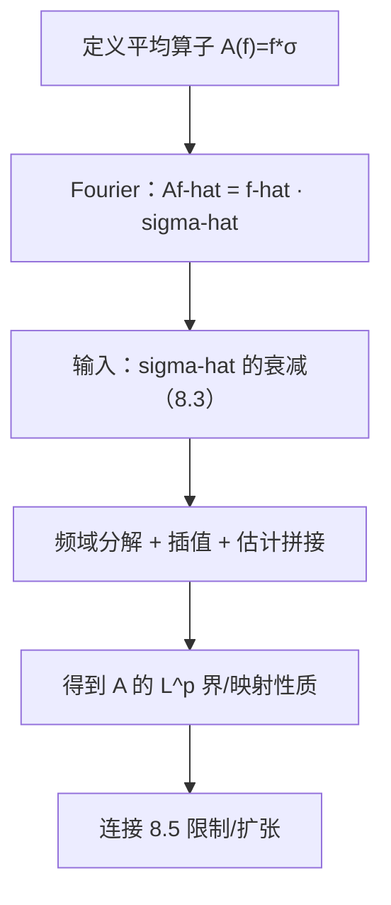

**相关笔记：** [[8.3 支撑曲面测度的Fourier变换]] | [[8.5 限制定理]] | [[第08章 Fourier分析中的振荡积分 — 章节汇总]]

> [!abstract] 概览
> ==核心术语==：平均算子｜卷积核 $\sigma$｜频域乘子 $\widehat{\sigma}$｜衰减→有界性｜局部化/插值
> - 本节的目标是“把频域估计搬回算子”：由 8.3 得到的 $\widehat{\sigma}(\xi)$ 衰减，如何转化为平均算子（或相关算子）的 $L^p$ 有界性/估计
> - 第一轮抓手：把平均算子写成卷积/乘子形式，再用频域分解与插值把估计拼出来
> - 关键点：曲率（或非退化）通过衰减进入算子界；曲率退化会导致算子估计失败或变弱
^overview

---

# 1. 本节主题定位
- **本节的核心问题**
  - 给定某曲面测度 $\sigma$，定义平均算子 $Af=f*\sigma$（或教材等价定义），如何利用 $\widehat{\sigma}$ 的衰减得到 $A$ 的范数估计？
- **本节在本章知识链中的位置**
  - 从“几何 Fourier 衰减（8.3）”回到“算子”，为 8.5 限制问题与后续应用提供算子化视角。
- **本节依赖哪些前置概念/定理**
  - 8.3：$\widehat{\sigma}$ 的衰减估计
  - Fourier 变换的卷积-乘子对应：$\widehat{f*\sigma}=\widehat{f}\cdot\widehat{\sigma}$
- **本节为后续哪些内容铺路**
  - 8.5：限制问题与扩张算子常与曲面平均/乘子估计互相转换
  - 8.6：色散核的估计也可视为某种“乘子/卷积核”的衰减控制

# 2. 内容分层图
- **概念层**：平均算子、卷积核、乘子、频域分解
- **命题层**：衰减估计 $\Rightarrow$ 某类 $L^p$ 有界性/弱型估计（教材口径）
- **方法层**：频域局部化（dyadic 分解）、插值、Plancherel/Young 型不等式
- **过渡层**：连接到限制定理/色散估计的“算子接口”

# 3. 定义系统
## 3.1 平均算子（以曲面测度为核）
- **定义名称**：平均算子（averaging operator）
- **严格表述（教材口径）**
  - 常见形式：$A f(x)=\int f(x-y)\,d\sigma(y)$（卷积形式），或教材给出的等价定义。
- **定义对象是什么**
  - 一个把函数“沿曲面做平均”的算子；其正则化/有界性与曲面几何密切相关。
- **为什么要这样定义**
  - 它是“曲面几何 → 分析估计”的典型载体：几何信息通过 $\widehat{\sigma}$ 的衰减进入算子估计。
- **最小例子**
  - 球面平均算子（对球面测度做卷积）。
- **非例/边界情况**
  - 若核对应曲率退化的集合，平均效果变弱，算子可能更接近奇异积分或失去改善性。
- **初学者误区**
  - 以为“平均一定让函数更光滑/更小”；实际上是否改善取决于核的频域衰减与维数/指数匹配。

## 3.2 乘子视角
- **定义名称**：Fourier 乘子 $\widehat{\sigma}$
- **严格表述**
  - $\widehat{Af}(\xi)=\widehat{f}(\xi)\widehat{\sigma}(\xi)$。
- **它解决了什么问题**
  - 把“算子估计”转为“乘子估计/频域分解问题”，可直接利用 8.3 的衰减。

# 4. 定理/命题系统
## 4.1 衰减估计 → 平均算子估计（接口命题）
> [!quote] 原文直接信息（以教材为准）
> 教材将平均算子写成卷积/乘子形式，并利用曲面测度 Fourier 衰减估计，通过频域分解与插值等步骤得到平均算子的有界性或相关估计；关键几何条件通过衰减进入证明。

- **定理名称**：曲面平均算子估计（由 $\widehat{\sigma}$ 衰减导出）
- **准确内容（结构化）**
  - 在教材条件下，可从 $|\widehat{\sigma}(\xi)|$ 的衰减推出 $A$ 在某些 $L^p$ 空间上的有界性/改善性结论（具体指数范围以教材为准）。
- **条件逐条解释**
  1) $\widehat{\sigma}$ 衰减：提供“高频压制”
  2) 频域分解：把不同频率段的贡献分开估计并求和
  3) 插值/Plancherel：在两个端点估计之间插值得到中间 $p$
- **证明骨架（Step 1/2/3）**
  - Step 1：写成乘子：$\widehat{Af}=\widehat{f}\widehat{\sigma}$
  - Step 2：做 dyadic 分解：按 $|\xi|\sim 2^k$ 分块，用衰减估计控制每块
  - Step 3：用端点估计（例如 $L^2$ 的 Plancherel、$L^1\to L^\infty$ 的核估计）+ 插值 + 求和收口
- **证明中最关键的一跳**
  - 如何把衰减估计转成“每个频段的算子范数衰减”，并保证频段求和收敛。
- **后续用途**
  - 为限制定理的算子化视角提供工具；也可作为 PDE 核估计的一种原型。
- **若条件削弱，哪里可能出问题**
  - 曲率退化导致衰减不足，频段求和发散，或只能得到更弱的映射性质。

# 5. 例子与反例系统
- **本节最关键的例子**
  - 球面平均：曲率非退化 → $\widehat{\sigma}$ 衰减好 → 平均算子有较强估计。
- **本节最值得补的反例**
  - “平直核/退化曲面”导致衰减差，从而算子不改善或估计失败（第二轮可补具体失败例）。
- **每个例子/反例分别服务于什么理解点**
  - 例子：说明“几何衰减如何变成算子界”。
  - 反例：说明几何条件是发动机，不是装饰。

# 6. 本节逻辑链复原
1) 作者先把 8.3 的频域衰减当作输入。  
2) 然后把平均算子写成卷积/乘子，建立“频域控制算子”的通道。  
3) 再用分解+插值把估计拼出来，得到可引用的 $L^p$ 结论。  
4) 最后把该通道作为 8.5 限制问题的准备。

# 7. 本节高风险误区
1) **只会写 $Af=f*\sigma$，不会写成乘子形式**
   - 正确理解：必须写出 $\widehat{Af}=\widehat{f}\widehat{\sigma}$ 才能用 8.3 的衰减。
2) **不知道为什么要做频域分解**
   - 正确理解：衰减是“随频率变化”的，分解后才能逐段估计并求和。
3) **端点估计选错**
   - 正确理解：常用端点是 $L^2$（Plancherel）与 $L^1\to L^\infty$（核界）；中间靠插值。
4) **把“衰减好”误读为“立刻得到所有 $p$ 的界”**
   - 正确理解：还需要匹配维数、求和收敛与插值结构；指数范围通常有门槛。
5) **KaTeX/mermaid 门禁问题**
   - 正确理解：避免对齐环境与未闭合代码块；推导用列表+分段公式。

# 8. 知识库拆分建议
- **A类：应独立成概念卡**
  - 平均算子（卷积核视角/乘子视角）
  - dyadic 分解与插值（工具卡）
- **B类：应独立成定理卡**
  - “$\widehat{\sigma}$ 衰减 ⇒ 平均算子估计”的接口定理
- **C类：只保留在本节页中**
  - 从 8.3 到 8.4 的“频域→算子”转换链
- **D类：建议作为专题综述页的候选节点**
  - “几何核算子谱系”（球面平均、圆锥平均、退化情形等）

# 9. 后续学习接口
- **适合下一轮展开证明的点**
  - 频域分块的精确算子范数估计与求和细节（把常数与指数写严谨）。
- **适合设计习题的点**
  - 给定一个乘子衰减假设，推导相应的 $L^p$ 有界性范围（训练分解+插值）。
- **适合与前一节做比较的点**
  - 8.3 给衰减（频域对象）；本节把衰减用在算子估计（空间对象）。
- **适合与下一节做衔接的点**
  - 8.5 的限制定理也常被写成某种扩张算子估计；本节提供“怎么做算子估计”的写作模板。

# 10. 自测问题
1) 写出平均算子 $Af$ 的卷积形式与 Fourier 乘子形式。  
2) 为什么 $\widehat{\sigma}$ 的衰减对 $A$ 的有界性重要？一句话解释其直觉。  
3) 说明频域 dyadic 分解的目的是什么，分解后每块要估计什么量。  
4) 插值在证明里扮演什么角色？为什么需要端点估计？  
5) 如果曲率退化导致衰减变弱，你预期平均算子估计会在哪一步失败？

---

## 引用
![[00-Raw素材/泛函分析/08_第8章_Fourier分析中的振荡积分/8.4_回到平均算子.pdf]]
