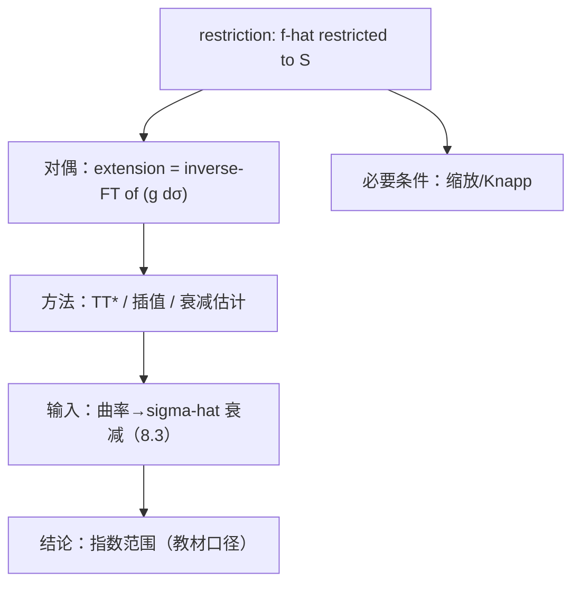

**相关笔记：** [[8.4 回到平均算子]] | [[8.6 对一些色散方程的应用]] | [[第08章 Fourier分析中的振荡积分 — 章节汇总]]

> [!abstract] 概览
> ==核心术语==：restriction｜extension｜缩放（scaling）｜Knapp 型必要条件｜曲率/非退化
> - 本节讨论“Fourier 变换限制到曲面”这一类核心不等式：什么时候 $\,\widehat{f}\,$ 可以在曲面上有意义并满足 $L^p\to L^q$ 型估计？
> - 第一轮的关键不是追最强指数，而是建立三件事：**(i) restriction 与 extension 的等价改写；(ii) 指数范围的必要条件从哪里来（缩放/反例）；(iii) 曲率为何是发动机**
^overview

---

# 1. 本节主题定位
- **本节的核心问题**
  - 给定曲面 $S$ 与其测度 $\sigma$，讨论形如
    - restriction：$\|\widehat{f}\|_{L^q(S,d\sigma)} \le C\|f\|_{L^p(\mathbb R^d)}$
    - extension：$\|(g\,d\sigma)^\vee\|_{L^{p'}(\mathbb R^d)} \le C\|g\|_{L^{q'}(S,d\sigma)}$
    的估计在什么条件下成立（指数范围/几何条件）。
- **本节在本章知识链中的位置**
  - 8.3–8.4 给出了曲面 Fourier 衰减与算子估计视角；本节把这些输入组织成“限制问题”的核心框架。
- **本节依赖哪些前置概念/定理**
  - 8.3：曲面测度 Fourier 衰减（曲率提供衰减）
  - 8.4：算子化与乘子化视角
- **本节为后续哪些内容铺路**
  - 8.6：色散/Strichartz 型估计与 restriction 思想常有紧密联系（第一轮先建立接口）
  - 8.7：Radon/几何积分变换也可进入类似的 Fourier 接口框架

# 2. 内容分层图
- **概念层**：restriction、extension、对偶性、缩放
- **命题层**：限制定理（教材版本）；必要条件（缩放/Knapp）
- **方法层**：对偶化、TT*、插值、利用曲面 Fourier 衰减
- **过渡层**：把 restriction 视为“曲面几何 + 振荡积分估计”的汇合点

# 3. 定义系统
## 3.1 restriction（限制算子）
- **定义名称**：限制算子 $R_S$
- **严格表述（形式化口径）**
  - $R_S f = \widehat{f}\big|_S$（把 Fourier 变换限制到曲面 $S$）。
- **定义对象是什么**
  - 一个“并不总有意义”的操作：一般 $L^p$ 函数的 Fourier 变换未必能逐点限制到测度为零的曲面上。
- **为什么要这样定义**
  - 目标是建立一个可用的不等式，使“限制”成为良定义且可控。
- **初学者误区**
  - 以为 restriction 是点态操作；实际上是要在不等式意义下理解并证明它良定义。

## 3.2 extension（扩张算子）
- **定义名称**：扩张算子 $E_S$
- **严格表述**
  - $E_S g = (g\,d\sigma)^\vee$（把曲面上的函数通过反 Fourier 变换扩张到全空间）。
- **为什么要这样定义**
  - 通过对偶性，restriction 估计常等价于 extension 估计，后者更像“积分算子核的估计”，便于用振荡积分工具。

## 3.3 缩放与必要条件（第一轮口径）
- **定义名称**：缩放/Knapp 型必要条件（方向）
- **严格表述**
  - 通过对 $f$ 做尺度变换与在频域构造“集中在小帽子/薄邻域”的测试函数，推导指数范围必须满足的代数关系（具体形式以教材为准）。
- **它解决了什么问题**
  - 告诉你“最强范围不可能无限好”：指数范围受几何与缩放硬约束。

# 4. 定理/命题系统
## 4.1 限制定理（教材版本）
> [!quote] 原文直接信息（以教材为准）
> 教材给出了在某些曲面（具有相应几何条件）上的限制不等式，并通过对偶化/TT* 等方法将其化为核估计；关键输入来自曲面测度 Fourier 衰减与振荡积分估计。

- **定理名称**：限制定理（restriction theorem，教材命名为准）
- **准确内容（结构化）**
  - 在教材给定的曲面与指数范围下，restriction/extension 满足某个 $L^p\to L^q$ 型估计（具体指数以教材为准）。
- **条件逐条解释**
  1) 曲面几何条件（曲率/非退化）：保证存在衰减与核估计
  2) 指数范围：由缩放与反例约束（必要条件），证明给出充分条件
  3) 测度/归一化：影响常数与对偶形式（常是易错点）
- **结论到底在说什么**
  - 让“$\widehat{f}$ 限制到 $S$”成为可控操作，并提供可用于后续 PDE/几何分析的范数界。
- **证明骨架（Step 1/2/3）**
  - Step 1：对偶化，把 restriction 转成 extension
  - Step 2：用 TT* 把 extension 的范数界化成卷积核（与 $\widehat{\sigma}$ 或相关核有关）
  - Step 3：用 8.3 的衰减估计 + 插值/分解收口得到指数范围内的界
- **证明中最关键的一跳**
  - TT* 后出现的核估计：衰减是否足够、如何分频率段求和，决定最终指数范围。
- **后续用途**
  - 8.6：色散方程估计中常出现类似的 extension 算子结构
- **若条件削弱，哪里可能出问题**
  - 曲率退化：衰减不够，核估计失效
  - 指数超出必要条件：Knapp 型构造会直接给出反例

# 5. 例子与反例系统
- **本节最关键的例子**
  - 典型曲面（球面/抛物面/圆锥等）上的 restriction/extension 框架（以教材选择为准）。
- **本节最值得补的反例**
  - Knapp 型反例方向：在频域取“靠近曲面的小帽子”，使空间中函数呈现长管状，从而逼出指数限制。
- **每个例子/反例分别服务于什么理解点**
  - 例子：让你把定理看作“几何条件+指数范围”的组合接口。
  - 反例：让你知道指数范围不是技术问题，而是结构性约束。

# 6. 本节逻辑链复原
1) 作者提出问题：Fourier 变换能否限制到测度为零的曲面上并满足范数界？  
2) 通过对偶化得到 extension 形式，使问题更像积分算子估计。  
3) 再用 TT* 与曲面 Fourier 衰减把问题落到核估计。  
4) 最后用缩放与反例解释指数范围的边界。

# 7. 本节高风险误区
1) **把 restriction 当成点态定义**
   - 正确理解：它是“通过不等式保证良定义”的操作。
2) **对偶化写错（指数共轭/测度）**
   - 正确理解：必须写清 $p'$、$q'$ 与 $d\sigma$ 的位置。
3) **忘记先做必要条件检查**
   - 正确理解：先用缩放/Knapp 判断“结论是否可能”，再谈证明。
4) **把曲率当背景**
   - 正确理解：曲率是发动机，决定衰减，决定核估计是否能做。
5) **KaTeX 与符号归一化问题**
   - 正确理解：避免对齐环境；尤其注意 Fourier 变换正负号与常数约定，与库内其它章节保持一致。

# 8. 知识库拆分建议
- **A类：应独立成概念卡**
  - restriction/extension/TT* 技巧
  - 缩放与 Knapp 型必要条件
- **B类：应独立成定理卡**
  - 限制定理（教材版本，带条件作用与证明骨架）
- **C类：只保留在本节页中**
  - “必要条件—充分条件—失败点”三段式结构图
- **D类：建议作为专题综述页的候选节点**
  - “限制猜想与相关问题谱系”（第二轮在 8.10 扩展）

# 9. 后续学习接口
- **适合下一轮展开证明的点**
  - TT* 后的核估计细节：分频率段、几何覆盖、插值路径。
- **适合设计习题的点**
  - 给定曲面与指数，先做缩放/Knapp 必要条件检查，再决定是否可能成立。
- **适合与前一节做比较的点**
  - 8.4 是平均算子估计；本节把同类思想推进到“曲面上的 Fourier 限制”。
- **适合与下一节做衔接的点**
  - 8.6 会把某些传播子写成 extension 型结构；本节的对偶化与 TT* 将成为可复用工具。

# 10. 自测问题
1) 用一句话区分 restriction 与 extension，并写出它们的形式。  
2) 为什么 restriction 不是对所有 $L^p$ 都自动良定义？你需要什么类型的不等式来保证它有意义？  
3) 说明 TT* 技巧在证明里把问题变成了什么（核/卷积/乘子）？  
4) 缩放/Knapp 型必要条件一般从什么构造来？它告诉你什么信息？  
5) 曲率/非退化条件在证明链条里负责哪一步（衰减/核估计/求和收敛）？

---

## 引用
![[00-Raw素材/泛函分析/08_第8章_Fourier分析中的振荡积分/8.5_限制定理.pdf]]
