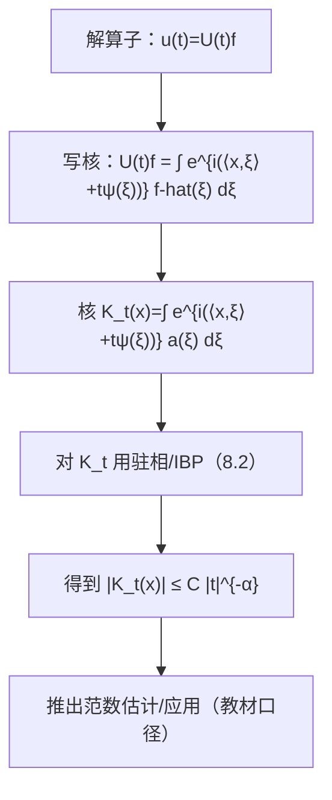

**相关笔记：** [[8.5 限制定理]] | [[8.7 Radon变换]] | [[第08章 Fourier分析中的振荡积分 — 章节汇总]]

> [!abstract] 概览
> ==核心术语==：色散（dispersion）｜传播子（propagator）｜振荡核｜时间衰减｜驻相/非退化 Hessian
> - 本节把“振荡积分估计”落到 PDE：许多线性色散方程的解算子可写成振荡积分（Fourier 反演形式）
> - 色散估计的核心直觉：相位的非退化二阶结构使不同频率“拉开”，产生时间方向的衰减
> - 第一轮抓骨架：传播子写成振荡积分 → 对核做驻相/分部积分 → 得到时间衰减 → 推出进一步的范数估计（教材口径）
^overview

---

# 1. 本节主题定位
- **本节的核心问题**
  - 如何用 8.2 的振荡积分工具从“解的表示式”推出“随时间衰减的估计”（色散估计）？
- **本节在本章知识链中的位置**
  - 应用线入口：把 8.1–8.5 的估计机制应用到 PDE 传播子。
- **本节依赖哪些前置概念/定理**
  - Fourier 反演与乘子算子表示
  - 8.2 驻相法/IBP 模板
  - 8.5 的算子化视角（很多 PDE 估计也可写成 extension/乘子形式）
- **本节为后续哪些内容铺路**
  - 为后续章节（若继续讨论）建立“传播子=振荡积分”的通用接口

# 2. 内容分层图
- **概念层**：线性方程、传播子、相位函数、群速度/色散直觉
- **命题层**：时间衰减（dispersive estimate）；由其推出的进一步 $L^p$ 估计（教材口径）
- **方法层**：把核写为振荡积分；找驻点并做驻相；或在无驻点区域做 IBP
- **过渡层**：将 PDE 估计与 restriction/曲面 Fourier 衰减联系

# 3. 定义系统
## 3.1 传播子（第一轮口径）
- **定义名称**：传播子 $U(t)$
- **严格表述（教材口径）**
  - 由线性方程的频域表示（乘子）定义的算子族；常可写成 $U(t)f=(m_t\widehat f)^\vee$。
- **定义对象是什么**
  - 给定初值 $f$，输出时刻 $t$ 的解 $u(t)$。
- **为什么要这样定义**
  - 频域相位里出现 $t$，从而自然导出“随时间的振荡”，这正是色散衰减来源。
- **最小例子（方向）**
  - Schrödinger/波方程传播子（以教材选择为准）。
- **误区**
  - 忽略相位的符号/常数约定；这会导致估计写法不一致（本库应保持与其它 Fourier 章节同一约定）。

## 3.2 色散估计（dispersive estimate）
- **定义名称**：色散估计（时间衰减）
- **严格表述（典型形态）**
  - 形如 $\|U(t)f\|_{L^\infty}\le C|t|^{-\alpha}\|f\|_{L^1}$ 或等价的核界 $|K_t(x)|\le C|t|^{-\alpha}$（以教材为准）。
- **它解决了什么问题**
  - 提供“随时间衰减”的定量信息，常作为进一步空间-时间估计的基础。

# 4. 定理/命题系统
## 4.1 传播子核的驻相估计（教材口径）
> [!quote] 原文直接信息（以教材为准）
> 教材把某些色散方程的解算子写成带大参数（时间）的振荡积分，并在相位满足非退化条件时应用驻相法得到核的时间衰减估计；随后用该衰减推出进一步的范数结论/应用。

- **定理名称**：色散估计（由振荡积分导出）
- **准确内容（结构化）**
  - 在教材假设下，传播子核满足某个时间衰减界，从而得到 $L^1\to L^\infty$（或类似）估计。
- **条件逐条解释**
  1) 相位二阶非退化（Hessian/曲率类条件）：保证驻相法给出衰减
  2) 振幅局部化/光滑：保证误差控制
  3) 频域支撑或截断：避免低频/高频的特殊退化区间（教材若做分段处理）
- **证明骨架（Step 1/2/3）**
  - Step 1：把 $U(t)$ 写成积分核 $K_t$ 的形式（Fourier 反演）
  - Step 2：把 $t$ 视为大参数，对 $K_t$ 作驻相/IBP 分解
  - Step 3：得到核界并转为算子范数界（例如 $L^1\to L^\infty$）
- **证明中最关键的一跳**
  - 证明“驻点非退化/曲率条件成立”，从而能把 $t$ 的振荡换成 $|t|^{-\alpha}$。
- **后续用途**
  - 为进一步的空间-时间估计或非线性分析提供基础（第一轮只建立接口，不展开全部细节）。
- **若条件削弱，哪里可能出问题**
  - 相位退化会导致衰减变弱甚至消失；对应的 PDE 传播性质也会改变。

# 5. 例子与反例系统
- **本节最关键的例子**
  - 典型色散方程（教材选取的方程）：传播子核是振荡积分，衰减指数由维数/相位二阶结构决定。
- **本节最值得补的反例**
  - 非色散/退化色散：若相位缺少非退化结构，时间衰减不成立或显著变弱。
- **服务理解点**
  - 例子：建立“PDE 估计来自振荡积分”的统一视角；反例：强调几何/非退化条件是发动机。

# 6. 本节逻辑链复原
1) 作者先把解写成 Fourier 反演形式，显式暴露出含 $t$ 的相位。  
2) 然后把核识别为振荡积分，直接调用 8.2 的估计模板。  
3) 最后把核的时间衰减转化为算子范数估计，并说明其在 PDE 分析中的用途。

# 7. 本节高风险误区
1) **不会把传播子写成振荡积分核**
   - 正确理解：先写 $\widehat{u}(t,\xi)=m_t(\xi)\widehat{f}(\xi)$，再反演得到核。
2) **忽略相位的非退化条件**
   - 正确理解：时间衰减来自驻相；必须说明 Hessian/曲率为何非退化。
3) **把核界与算子界混淆**
   - 正确理解：核界给 $L^1\to L^\infty$；其它 $L^p$ 需要插值或额外结构。
4) **Fourier 约定混乱**
   - 正确理解：本库需统一正负号与常数；否则同一公式在不同节会对不上。
5) **KaTeX 对齐环境导致渲染失败**
   - 正确理解：避免对齐环境；推导用列表与分段公式块。

# 8. 知识库拆分建议
- **A类：应独立成概念卡**
  - 传播子与色散估计（作为 PDE 接口概念）
  - “核=振荡积分”的写法模板
- **B类：应独立成定理卡**
  - 色散估计（教材版本，附条件作用与证明骨架）
- **C类：只保留在本节页中**
  - 本章工具（8.2）如何嵌入 PDE 的叙事链
- **D类：建议作为专题综述页的候选节点**
  - “restriction 与色散估计的关系”专题（第二轮展开）

# 9. 后续学习接口
- **适合下一轮展开证明的点**
  - 驻相法在 PDE 核上的精确实现（分区、低频处理、误差项）。
- **适合设计习题的点**
  - 给定相位 $\psi(\xi)$，判断驻点结构与预期衰减指数，并写出证明骨架。
- **适合与前一节做比较的点**
  - 8.5 是曲面上的 Fourier 接口；本节是时间演化的 Fourier 接口。
- **适合与下一节做衔接的点**
  - 8.7/8.8 的几何与计数问题同样可由 Fourier-振荡估计驱动；本节提供“应用写法模板”。

# 10. 自测问题
1) 传播子 $U(t)$ 为什么会带来“随时间的振荡”？它在频域表现为什么形式？  
2) 如何从 $U(t)$ 写出积分核 $K_t(x)$？  
3) 时间衰减 $|t|^{-\alpha}$ 在证明里来自哪一步（驻相/IBP）？  
4) 哪个条件对应“驻点非退化”？它在证明链条中负责什么？  
5) 核界如何推出算子范数界（至少说明 $L^1\to L^\infty$ 的那条路）？

---

## 引用
![[00-Raw素材/泛函分析/08_第8章_Fourier分析中的振荡积分/8.6_对一些色散方程的应用.pdf]]
