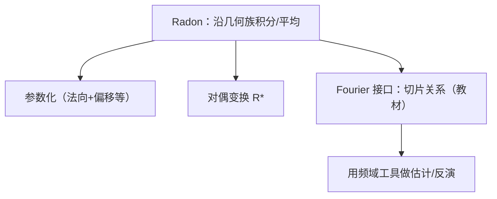

**相关笔记：** [[8.6 对一些色散方程的应用]] | [[8.8 格点计数]] | [[第08章 Fourier分析中的振荡积分 — 章节汇总]]

> [!abstract] 概览
> ==核心术语==：Radon 变换｜超平面平均｜对偶变换｜Fourier slice（切片）关系｜几何→频域接口
> - 本节把“沿几何对象积分”的算子系统化：Radon 变换把函数沿超平面（或教材指定的几何族）做积分/平均
> - 关键接口是 Fourier：Radon 变换往往与 Fourier 变换存在切片关系（具体形式以教材为准）
> - 第一轮目标：写清定义、对偶、核心恒等式的作用，以及它如何连接到本章的振荡估计与限制思想
^overview

---

# 1. 本节主题定位
- **本节的核心问题**
  - Radon 变换是什么、它把函数变成什么对象、以及它为何能被 Fourier 工具有效分析？
- **本节在本章知识链中的位置**
  - 几何积分变换线：与 8.3 曲面 Fourier、8.5 限制问题共享“几何→频域”的思想。
- **本节依赖哪些前置概念/定理**
  - Fourier 变换与卷积/乘子接口
  - 8.2 振荡积分估计（某些 Radon 型核也会落入振荡积分框架）
- **本节为后续哪些内容铺路**
  - 8.8 格点计数中的几何/Poisson 思路与 Radon/几何 Fourier 常互相借力

# 2. 内容分层图
- **概念层**：Radon 变换、几何参数（超平面的参数化）、对偶变换
- **命题层**：Radon 与 Fourier 的关键恒等式（切片关系）及其推论
- **方法层**：把几何积分变换转为频域乘子/切片，再用估计工具
- **过渡层**：连接到限制估计、PDE 与几何计数

# 3. 定义系统
## 3.1 Radon 变换（教材口径）
- **定义名称**：Radon 变换 $Rf$
- **严格表述（以教材为准）**
  - 把 $f$ 在空间中沿某类超平面（或子流形）积分，输出为“关于超平面参数的函数”。
- **定义对象是什么**
  - 输入：$\mathbb R^d$ 上函数；输出：几何参数空间上的函数（本质上是“投影型数据”）。
- **为什么要这样定义**
  - 它是把高维对象投影成低维数据的标准算子，在层析成像与 Fourier 分析中都极核心。
- **最小例子**
  - $\mathbb R^2$ 中沿直线积分的 Radon 变换（最经典）。
- **初学者误区**
  - 混淆“积分”与“平均”（是否除以测度/归一化）；这会影响反演公式与常数。

## 3.2 对偶变换（back-projection）
- **定义名称**：对偶 Radon 变换 $R^*$
- **严格表述**
  - 把参数空间上的函数再“回投影”到空间中（把经过某点的所有超平面贡献累加）。
- **它解决了什么问题**
  - 反演与估计常通过 $R^*R$（类似 TT*）来做，因为它更像卷积/乘子算子。

# 4. 定理/命题系统
## 4.1 Fourier slice（切片）关系/反演接口
> [!quote] 原文直接信息（以教材为准）
> 教材给出 Radon 变换与 Fourier 变换之间的关键恒等式（切片关系或等价表述），并据此导出某些反演/估计结论；证明通常通过交换积分与对参数化的 Fourier 变换计算完成。

- **定理名称**：Radon–Fourier 关系（切片/乘子接口）
- **准确内容（结构化）**
  - Radon 变换在适当变量上做 Fourier 变换后，与 $f$ 的 Fourier 变换在某个几何集合（例如某条射线/某个截面）上的值相关（具体关系式以教材为准）。
- **条件逐条解释**
  - 合法的交换积分/可积性：保证推导严谨
  - 归一化常数：取决于 Fourier 约定与 Radon 的“平均/积分”版本
- **证明骨架（Step 1/2/3）**
  - Step 1：写出 $Rf$ 的参数化积分表达式
  - Step 2：对参数变量做 Fourier 变换并交换积分顺序
  - Step 3：识别得到的表达为 $\widehat f$ 在某几何集合上的限制，从而得到接口公式
- **证明中最关键的一跳**
  - “正确的参数化 + 变量替换”使得相位线性化，从而出现切片关系。
- **后续用途**
  - 用 $R^*R$ 或切片关系把 Radon 的估计问题转成乘子/限制型问题。
- **若条件削弱，哪里可能出问题**
  - 归一化写错会导致反演常数错；可积性不足会导致交换积分不合法。

# 5. 例子与反例系统
- **本节最关键的例子**
  - 平面 Radon 变换：直线积分 → 在频域形成“沿方向的切片”信息（最直观的接口例子）。
- **本节最值得补的反例**
  - 若不做合适归一化（平均 vs 积分），反演公式会差常数甚至差尺度，导致“看懂但不会用”。
- **服务的理解点**
  - 例子服务于“几何→频域”的直觉；反例服务于“归一化门禁”的警惕。

# 6. 本节逻辑链复原
1) 作者先定义沿超平面族积分的算子 $R$。  
2) 再引入对偶 $R^*$，把估计/反演问题转向 $R^*R$ 这类更像卷积的对象。  
3) 用 Fourier 计算得到切片关系，从而把几何积分变换纳入本章的 Fourier/振荡工具体系。

# 7. 本节高风险误区
1) **参数化写错（法向/偏移的量词）**
   - 正确理解：先写清超平面由哪些参数决定，哪些参数被积分消掉。
2) **平均与积分混淆**
   - 正确理解：是否除以测度是一个定义选择；必须全节一致。
3) **Fourier 约定不一致**
   - 正确理解：要与本库其它 Fourier 章节一致，否则切片公式会多出常数/符号。
4) **把 $R^*R$ 当成“随便卷积”**
   - 正确理解：需要说明它为什么是乘子/卷积型，以及核的奇性在哪里。
5) **抄 PDF 公式排版导致 KaTeX 崩**
   - 正确理解：避免对齐环境；多行推导用列表+分段公式块。

# 8. 知识库拆分建议
- **A类：应独立成概念卡**
  - Radon 变换、对偶变换、参数化
- **B类：应独立成定理卡**
  - Fourier slice 关系/反演接口（教材版本）
- **C类：只保留在本节页中**
  - 本章主线下 Radon 的定位：它是“几何积分→频域切片”的典型
- **D类：建议作为专题综述页的候选节点**
  - “几何积分变换的 TT*/乘子化框架”专题（与 8.5 相呼应）

# 9. 后续学习接口
- **适合下一轮展开证明的点**
  - $R^*R$ 的精确乘子表达与映射性质（可与限制估计联系）。
- **适合设计习题的点**
  - 在低维（如 $\mathbb R^2$）推导切片关系，并校对常数/符号。
- **适合与前一节做比较的点**
  - 8.6 是时间振荡（PDE）；本节是几何积分（空间几何）。
- **适合与下一节做衔接的点**
  - 8.8 的 Poisson/计数也依赖“几何对象的 Fourier 指纹”；Radon 提供一类结构化工具。

# 10. 自测问题
1) Radon 变换的输入/输出分别是什么？输出变量代表什么几何意义？  
2) 对偶变换 $R^*$ 的直觉是什么？为什么常研究 $R^*R$？  
3) 你能用三步写出切片关系证明骨架吗（参数化、Fourier、交换积分）？  
4) 平均 vs 积分的归一化差异会如何影响反演/估计？  
5) 说明 Radon–Fourier 接口与本章 restriction/extension 思想的相似点在哪里。

---

## 引用
![[00-Raw素材/泛函分析/08_第8章_Fourier分析中的振荡积分/8.7_Radon变换.pdf]]

