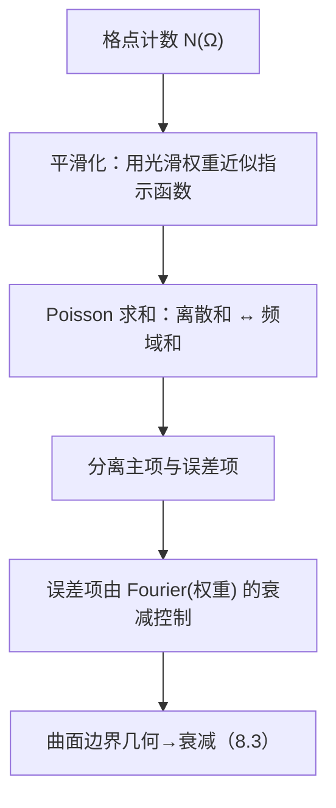

**相关笔记：** [[8.7 Radon变换]] | [[8.9 习题]] | [[第08章 Fourier分析中的振荡积分 — 章节汇总]]

> [!abstract] 概览
> ==核心术语==：格点计数｜平滑化（smoothing）｜Poisson 求和｜误差项｜曲面 Fourier 衰减
> - 本节展示“振荡估计的数论型应用”：把几何区域中的格点数转化为 Fourier 级数/振荡和
> - 第一轮抓骨架：计数函数 → 平滑化 → Poisson 求和 → 主项与误差项分离 → 用曲面 Fourier 衰减控制误差
> - 本节的价值在于：让你看到 8.2–8.3 的估计不是只为分析服务，它能直接产生“误差项衰减”结论
^overview

---

# 1. 本节主题定位
- **本节的核心问题**
  - 如何估计某些区域（或其边界相关对象）内的格点数？误差项为什么与曲面 Fourier 衰减相关？
- **本节在本章知识链中的位置**
  - 应用线收束：把振荡积分与曲面衰减用于“离散计数”。
- **本节依赖哪些前置概念/定理**
  - 8.3：曲面测度 Fourier 衰减
  - Poisson 求和公式（教材若引入，以其版本为准）
  - 平滑化/截断思想（把硬指示函数换成光滑近似）
- **本节为后续哪些内容铺路**
  - 8.9 习题中的“Poisson+衰减”题型；以及更广泛的解析数论工具链。

# 2. 内容分层图
- **概念层**：计数函数、平滑化、Poisson、主项/误差项
- **命题层**：误差项估计与曲率/衰减的关系（教材口径）
- **方法层**：把离散和转成频域和；用衰减估计控制高频
- **过渡层**：与 8.3（曲面 Fourier）形成闭环

# 3. 定义系统
## 3.1 计数函数（第一轮口径）
- **定义名称**：格点计数 $N(\Omega)$
- **严格表述**
  - 例如 $N(\Omega)=\#(\Omega\cap\mathbb Z^d)$（具体区域/缩放方式以教材为准）。
- **定义对象是什么**
  - 一个离散几何量；其主项通常与体积相关，难点在误差项。
- **为什么要这样定义**
  - 它是“连续几何”与“离散结构”之间的桥梁，且可用 Fourier 工具分析。
- **最小例子**
  - 盒子/球的格点数随尺度增长的主项与误差项。
- **误区**
  - 直接对指示函数做 Fourier 变换而忽略正则性（需要平滑化来合法交换/估计）。

## 3.2 平滑化（smoothing）
- **定义名称**：平滑化权重（cut-off / mollifier）
- **严格表述**
  - 用光滑函数近似指示函数，把硬边界变成可控的频域衰减。
- **它解决了什么问题**
  - 让 Fourier 变换具有足够衰减，从而 Poisson 求和后的频域和可收敛并可估计。
- **误区**
  - 不说明平滑参数如何选；参数选择决定主项逼近与误差控制的平衡。

## 3.3 Poisson 求和（接口）
- **定义名称**：Poisson 求和公式（教材版本）
- **严格表述**
  - 把 $\sum_{n\in\mathbb Z^d} f(n)$ 与 $\sum_{k\in\mathbb Z^d} \widehat f(k)$ 联系起来（常数与 Fourier 约定相关）。
- **为什么要这样定义**
  - 这是把“离散计数”变成“频域衰减估计”的关键通道。

# 4. 定理/命题系统
## 4.1 Poisson + 衰减 ⇒ 计数误差项（教材口径）
> [!quote] 原文直接信息（以教材为准）
> 教材通过对计数函数做平滑化并应用 Poisson 求和，把格点计数写成主项加上频域和；误差项由相关 Fourier 变换的衰减控制，而这种衰减进一步与边界几何/曲率条件相关。

- **定理名称**：格点计数误差项估计（Poisson 框架）
- **准确内容（结构化）**
  - $N(\Omega)$ 被分解为主项（体积型）+ 误差项；误差项可由某个 Fourier 衰减界给出上界（具体形式以教材为准）。
- **条件逐条解释**
  1) 平滑化：让 Fourier 衰减可用，避免硬边界导致的慢衰减
  2) Poisson 求和：把离散和转成频域和
  3) 边界几何/曲率：控制边界相关 Fourier 变换的衰减率，从而控制误差项
- **证明骨架（Step 1/2/3）**
  - Step 1：用光滑权重近似计数，写成 $\sum_{n\in\mathbb Z^d} w(n)$
  - Step 2：Poisson 求和得到 $\sum_{k\in\mathbb Z^d}\widehat w(k)$
  - Step 3：$k=0$ 给主项，其余 $k\ne0$ 用衰减估计求和得到误差界
- **证明中最关键的一跳**
  - 证明 $\widehat w(k)$ 有足够衰减并使 $\sum_{k\ne0}$ 收敛/可控（这一步往往依赖曲率/驻相）。
- **后续用途**
  - 将“曲面 Fourier 衰减”与“离散误差项”直接连接，形成应用闭环。
- **若条件削弱，哪里可能出问题**
  - 若边界几何退化导致衰减不足，则误差项求和可能变差；甚至无法得到期望的误差阶。

# 5. 例子与反例系统
- **本节最关键的例子**
  - 对典型区域（如球/凸体，教材选择为准）计数：主项是体积，误差项由边界曲率控制。
- **本节最值得补的反例**
  - 多面体/尖角边界等“非光滑/曲率退化”情形会显著恶化误差项（第二轮补具体例）。
- **服务的理解点**
  - 例子：展示“几何→衰减→误差”；反例：提醒你边界正则性与曲率是硬条件。

# 6. 本节逻辑链复原
1) 作者先把格点计数视为离散求和问题。  
2) 为了能用 Fourier 工具，先做平滑化。  
3) 用 Poisson 求和把问题搬到频域。  
4) 主项来自零频；误差项来自非零频，并用衰减估计收口。  
5) 衰减的几何来源由 8.3 提供，从而形成闭环。

# 7. 本节高风险误区
1) **不平滑化就直接 Poisson**
   - 正确理解：硬指示函数的 Fourier 衰减太差，误差项难控；平滑化是必要步骤。
2) **Poisson 常数/符号写错**
   - 正确理解：必须与本库 Fourier 约定一致，否则主项系数会错。
3) **只写“误差项可控”，不说明为何求和收敛**
   - 正确理解：要指出衰减率与维数如何保证 $\sum_{k\ne0}$ 可估计。
4) **把边界几何当背景**
   - 正确理解：边界正则性/曲率决定衰减，决定误差阶。
5) **在推导中使用对齐环境/双反斜杠导致 KaTeX 崩**
   - 正确理解：用列表+分段公式块表达。

# 8. 知识库拆分建议
- **A类：应独立成概念卡**
  - Poisson 求和公式（接口卡）
  - 平滑化参数与误差平衡（工具卡）
- **B类：应独立成定理卡**
  - 格点计数误差项估计（教材版本）
- **C类：只保留在本节页中**
  - “平滑化→Poisson→分离主项/误差→衰减求和”的流程图
- **D类：建议作为专题综述页的候选节点**
  - “几何计数与 Fourier 分析”专题（连接凸几何/解析数论）

# 9. 后续学习接口
- **适合下一轮展开证明的点**
  - 平滑参数如何最优选取以平衡主项逼近与误差界（需要更细估计）。
- **适合设计习题的点**
  - 给定一个权重函数，要求写出 Poisson 求和分解并标注主项/误差项来源。
- **适合与前一节做比较的点**
  - 8.7 是几何积分变换；本节是离散计数，但两者都走“几何→频域接口”的路线。
- **适合与下一节做衔接的点**
  - 8.9 的习题很可能包含 Poisson+衰减的训练题；本节提供写作骨架。

# 10. 自测问题
1) 为什么格点计数可以用 Poisson 求和来处理？一句话说明思路。  
2) 平滑化做了什么？它在证明链条中负责哪一步？  
3) Poisson 求和后，为什么 $k=0$ 项对应主项？  
4) 误差项如何用 Fourier 衰减估计控制？哪一步需要 8.3 的曲面衰减输入？  
5) 若边界不光滑/曲率退化，你预期误差项会发生什么变化？为什么？

---

## 引用
![[00-Raw素材/泛函分析/08_第8章_Fourier分析中的振荡积分/8.8_格点计数.pdf]]
