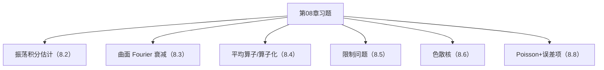

**相关笔记：** [[8.8 格点计数]] | [[8.10 问题]] | [[第08章 Fourier分析中的振荡积分 — 章节汇总]]

> [!abstract] 概览
> ==核心术语==：题型地图｜估计模板路由｜条件检查表｜“关键一跳”
> - 本节把第08章的做题套路压成一页：看到题面信号就能路由到 8.2/8.3/8.5/8.8 的对应模板
> - 第一轮不强制把所有题写成完整长证明，但必须写清：对象、要用的定理名、关键构造/关键一跳、条件作用
^overview

---

# 1. 本节主题定位
- **本节的核心问题**
  - 第08章习题主要训练哪几种“可复用动作”？每类题目应该如何快速选工具并写出证明骨架？
- **本节在本章知识链中的位置**
  - 训练入口：把 8.1–8.8 的结论转成可操作脚本（识别信号→调用接口→收口）。
- **本节依赖哪些前置概念/定理**
  - 8.2：振荡积分估计工具谱系（IBP/驻相/Van der Corput）
  - 8.3：曲面 Fourier 衰减接口
  - 8.5：restriction/extension 与必要条件
  - 8.8：Poisson+衰减控制误差项
- **本节为后续哪些内容铺路**
  - 8.10 的开放问题往往是“习题机制的边界/失败条件”，本节提供共同语言。

# 2. 内容分层图
- **概念层**：题型、信号词、关键条件、关键构造
- **命题层**：本章核心定理作为接口（8.2/8.3/8.5/8.8）
- **方法层**：分支树（无驻点/有驻点/几何非退化/缩放必要条件/Poisson）
- **过渡层**：从“会做题”到“会找反例/会定位失败点”（8.10）

# 3. 定义系统
## 3.1 题型地图（本库用语）
- **定义名称**：题型地图
- **严格表述**
  - 将每道题映射到：主题 → 应调用的节/定理 → 关键一跳（哪个条件负责哪一步）。
- **它解决了什么问题**
  - 第一轮确保“选对工具”；第二轮再把细节补齐。
- **初学者误区**
  - 把题型地图当成答案；正确做法是用它写出证明骨架与条件作用说明。

# 4. 定理/命题系统（本节只列“调用接口”）
> [!quote] 原文直接信息（本节定位）
> 本节对应教材“习题”分片；以训练为主，不新增主定理，而是训练如何调用本章的估计模板与几何接口。

## 4.1 调用接口清单
- 估计发动机：[[8.2 振荡积分]]（IBP/驻相/Van der Corput）
- 几何输入：[[8.3 支撑曲面测度的Fourier变换]]（曲率→衰减）
- 算子化：[[8.4 回到平均算子]]（衰减→算子界）
- 限制问题：[[8.5 限制定理]]（对偶/TT*/必要条件）
- 计数应用：[[8.8 格点计数]]（平滑化+Poisson+衰减）

# 5. 例子与反例系统
- **本节最关键的例子（题面识别示例）**
  - 题面出现“大参数 $\lambda$”或“相位函数 $\phi$”→ 直接路由到 8.2（先判驻点）。
  - 题面出现“曲面/球面/抛物面测度 Fourier 变换”→ 8.3（曲率/非退化检查）。
  - 题面出现“限制到曲面/extension”→ 8.5（先做缩放/必要条件）。
  - 题面出现“格点/计数误差/Poisson”→ 8.8（先平滑化再 Poisson）。
- **本节最值得补的反例**
  - 缺条件失败：驻点退化、曲率退化、指数超出必要条件、平滑化不足等。
- **服务的理解点**
  - 例子用于“快速选工具”；反例用于“条件不可省与失败点定位”。

# 6. 本节逻辑链复原
1) 作者把本章的核心机制做成习题：估计、几何、算子化、必要条件、应用。  
2) 因此做题的关键不是计算，而是先判定“属于哪条机制”。  
3) 只要能写出关键一跳与条件作用，就能把题目变成可继续补细节的证明骨架。

# 7. 本节高风险误区
1) **不判驻点就开始做分部积分**
   - 正确理解：先定位驻点集合与支撑关系（8.2 分支树）。
2) **把曲率当背景，不做几何检查**
   - 正确理解：曲率决定衰减，衰减决定算子界/限制范围（8.3–8.5）。
3) **不做必要条件检查就追“最强指数”**
   - 正确理解：先缩放/Knapp（8.5），否则很可能做无用功。
4) **不平滑化就 Poisson**
   - 正确理解：硬边界 Fourier 衰减差，误差项难控（8.8）。
5) **KaTeX/Mermaid 门禁导致整页渲染污染**
   - 正确理解：避免对齐环境与未闭合 code fence；多行推导用列表+分段公式。

# 8. 知识库拆分建议
- **A类：应独立成概念卡**
  - 题型地图（本节）
  - 条件检查表：驻点/曲率/缩放/平滑化
- **B类：应独立成定理卡**
  - 不新增；直接回链到 8.2/8.3/8.5/8.8 的定理接口
- **C类：只保留在本节页中**
  - “题面信号→调用接口→关键一跳”的总表
- **D类：建议作为专题综述页的候选节点**
  - “第08章做题模板总览”专题（可作为全书习题页模板）

# 9. 后续学习接口
- **适合下一轮展开证明的点**
  - 把每道题的“关键一跳”补齐为严格证明：尤其是驻相误差项与 TT* 核估计细节。
- **适合设计习题的点**
  - 识别题：给一句题面，要求写出“该用哪节模板 + 第一行证明 + 必要条件”。
- **适合与前一节做比较的点**
  - 8.8 是具体应用；本节把应用反过来抽象成题型。
- **适合与下一节做衔接的点**
  - 8.10 的问题多是“若削弱条件会怎样？”本节已列出常见失败点入口。

# 10. 自测问题
1) 看到振荡积分 $I(\lambda)$，你第一步应该检查什么？  
2) 看到曲面 Fourier 衰减题，你需要检查哪类几何条件？  
3) 看到限制定理题，为什么要先做缩放/Knapp 必要条件？  
4) 看到格点计数题，为什么要先平滑化？  
5) 任选本章一个估计模板，说出它的“关键一跳”以及失败会发生在哪一步。

---

## 引用
![[00-Raw素材/泛函分析/08_第8章_Fourier分析中的振荡积分/8.9_习题.pdf]]

