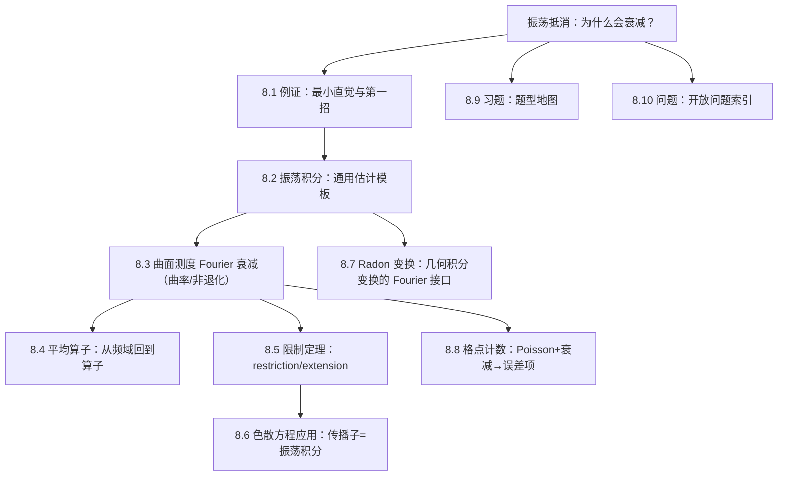

# 第08章 Fourier分析中的振荡积分 — 章节汇总

**相关笔记：** [[第07章 多复变引论 — 章节汇总]] | [[泛函分析/index]] | [[Wiki/index]]

> [!abstract] 概览
> 本章主线可以按“**振荡带来抵消**”来理解：从一个例证建立直觉（8.1），抽象为通用估计模板（8.2），再把估计推进到“曲面测度的 Fourier 衰减”（8.3）与“平均算子估计”（8.4），最终进入限制定理（8.5）与色散方程应用（8.6），并把工具延伸到几何积分变换（8.7）与格点计数（8.8）；8.9/8.10 用于训练题型与开放问题索引。

^overview

---

## 一、知识结构总览

---

## 二、各节入口（学习路线）

| 节 | 主题 | 你应带走的可复用套路（第一轮） |
|---|---|---|
| [[8.1 一个例证]] | 直觉建立 | 分部积分/抵消的“可用条件检查表” |
| [[8.2 振荡积分]] | 估计模板 | “条件→结论→用途”三段式模板（驻相/Van der Corput/分部积分） |
| [[8.3 支撑曲面测度的Fourier变换]] | 曲率与衰减 | 把“曲率/非退化”翻译成衰减指数与可用范围 |
| [[8.4 回到平均算子]] | 算子化 | 从 Fourier 衰减到平均算子估计的套路（分解/插值/局部化） |
| [[8.5 限制定理]] | restriction | 先抓“缩放+必要条件+典型充分条件”框架，不追最强范围 |
| [[8.6 对一些色散方程的应用]] | PDE 应用 | 传播子写成振荡积分；色散估计骨架（非退化 Hessian→时间衰减） |
| [[8.7 Radon变换]] | 几何积分变换 | 定义—对偶—Fourier slice（若教材给出）与限制/曲面 Fourier 的连接 |
| [[8.8 格点计数]] | 数论应用 | 平滑化+Poisson 求和+衰减估计控制误差项 |
| [[8.9 习题]] | 训练入口 | 题型地图：每题对应工具/定理接口与关键一跳 |
| [[8.10 问题]] | 结构问题 | “条件作用/失败点/开放方向”索引页 |

---

## 三、自测清单（逐条打勾）

- [ ] 我能用一句话说清“振荡为何带来抵消”，并指出最小可用条件（相位导数不为 0 / 驻点非退化等）。
- [ ] 我能写出一个振荡积分估计的通用三段式：条件→结论→用途，并能解释每个条件在证明中负责哪一步。
- [ ] 我能解释“曲率/非退化”如何导致 Fourier 衰减，并知道曲率退化会在哪里坏掉。
- [ ] 我能说明限制定理里指数范围为什么受缩放与 Knapp 型例子约束。
- [ ] 我能把某个 PDE 的传播子写成振荡积分，并指出“时间衰减”来自哪一步估计。

---

## 四、各节概览（快速回看）

- ![[8.1 一个例证#^overview]]
- ![[8.2 振荡积分#^overview]]
- ![[8.3 支撑曲面测度的Fourier变换#^overview]]
- ![[8.4 回到平均算子#^overview]]
- ![[8.5 限制定理#^overview]]
- ![[8.6 对一些色散方程的应用#^overview]]
- ![[8.7 Radon变换#^overview]]
- ![[8.8 格点计数#^overview]]
- ![[8.9 习题#^overview]]
- ![[8.10 问题#^overview]]

---

## 五、引用（PDF）

![[00-Raw素材/泛函分析/08_第8章_Fourier分析中的振荡积分/8.1_一个例证.pdf]]
![[00-Raw素材/泛函分析/08_第8章_Fourier分析中的振荡积分/8.2_振荡积分.pdf]]
![[00-Raw素材/泛函分析/08_第8章_Fourier分析中的振荡积分/8.3_支撑曲面测度的Fourier变换.pdf]]
![[00-Raw素材/泛函分析/08_第8章_Fourier分析中的振荡积分/8.4_回到平均算子.pdf]]
![[00-Raw素材/泛函分析/08_第8章_Fourier分析中的振荡积分/8.5_限制定理.pdf]]
![[00-Raw素材/泛函分析/08_第8章_Fourier分析中的振荡积分/8.6_对一些色散方程的应用.pdf]]
![[00-Raw素材/泛函分析/08_第8章_Fourier分析中的振荡积分/8.7_Radon变换.pdf]]
![[00-Raw素材/泛函分析/08_第8章_Fourier分析中的振荡积分/8.8_格点计数.pdf]]
![[00-Raw素材/泛函分析/08_第8章_Fourier分析中的振荡积分/8.9_习题.pdf]]
![[00-Raw素材/泛函分析/08_第8章_Fourier分析中的振荡积分/8.10_问题.pdf]]
