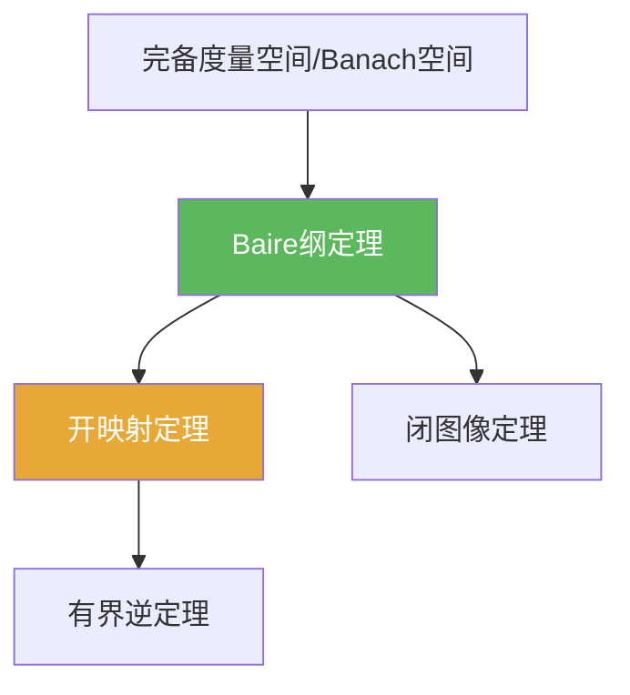

# Baire纲定理

> [!abstract] 概述
> Baire 纲定理是 Banach 空间“三件套”（开映射/闭图像/有界逆）的引擎：它把完备性转化为“集合不能处处稀薄”的结论，从而导出强有力的稳定性估计。

## 定理表述

> [!def] 定理（常用形式）
> 在完备度量空间中，可数个稠密开集的交仍稠密。

## 核心性质（命题工具箱）

| 性质/命题 | 表述（可直接引用） | 用途（做题时怎么用） |
|------|------|------|
| 完备性关键 | 定理在完备度量空间（Banach）成立；不完备时可失败 | 遇到反例题：通常从“不完备”入手 |
| “某闭集有内点”套路 | 若 $X=\bigcup_{n}F_n$ 且 $F_n$ 闭，则存在 $n$ 使 $F_n$ 有内点 | 开映射/闭图像/有界逆的标准引擎 |
| 稠密开集交稠密 | $\bigcap_n U_n$（$U_n$ 稠密开）仍稠密 | 证明“典型点/几乎处处”性质的常用形式 |

## 关系网络

## 章节扩展

### 第02章：线性算子与线性泛函

- 2.3：用 Baire 推出开映射/闭图像/有界逆：[[2.3 纲与开映射定理#二、核心思想]]

### 第04章：Baire纲定理的应用

- 4.1：本章定理的证明骨架与用法模板：[[4.1 Baire纲定理#二、核心思想]]

## 补充

> [!info] 常见误区与来源
>
> - 误区：忘记“完备性”是硬条件，从而在非完备空间中误用开映射/一致有界等结论。  
> - 误区：把 Baire 当作“测度意义的几乎处处”。Baire 是拓扑范畴（稠密/第一纲）语言。
>
> **参考（权威外链）**
> - https://ocw.mit.edu/courses/18-102-introduction-to-functional-analysis-spring-2021/038fc32ab9c1bb63a4f29bd9d7c97961_MIT18_102s21_lec4.pdf  
> - https://math.mit.edu/~rbm/18.155-F16/L11.pdf

## 参见

- [[开映射定理]]
- [[闭图像定理]]
- [[有界逆定理]]
