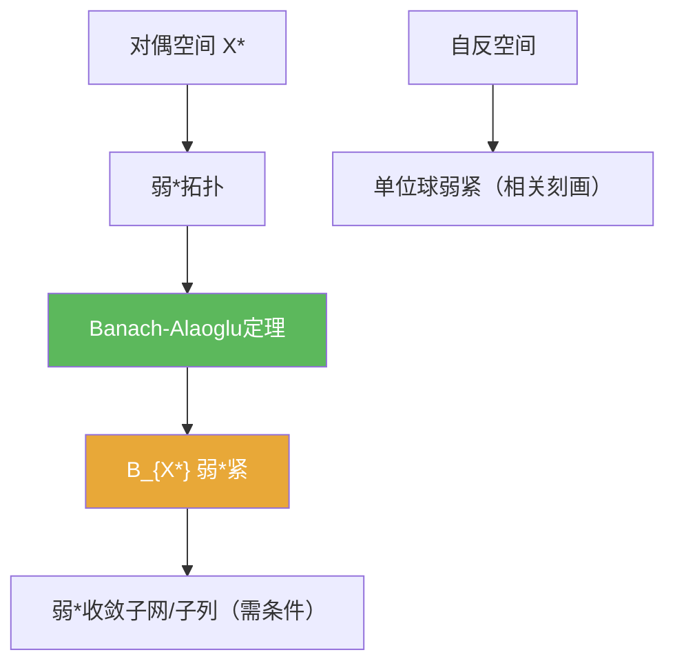

# Banach-Alaoglu定理

> [!abstract] 概述
> Banach–Alaoglu 定理给出对偶空间里最重要的紧性结论：$X^\*$ 的闭单位球在弱*拓扑下紧。它是“从有界抽取弱*极限”的标准收尾工具，并与自反空间的弱紧性密切相关。

## 定理表述

> [!def] 定理
> 设 $X$ 为赋范空间，则 $X^\*$ 的闭单位球
> $$B_{X^\*}=\{f\in X^\*:\|f\|\le 1\}$$
> 在弱*拓扑下是紧的。

## 核心性质（命题工具箱）

| 性质/命题 | 表述（可直接引用） | 用途（做题时怎么用） |
|------|------|------|
| 弱*紧性 | $B_{X^*}$ 在弱*拓扑下紧 | 处理“对偶单位球里的有界序列/网”时的收尾工具 |
| 子网/子列抽取 | 紧性保证存在收敛子网；若额外可度量化条件成立才可谈子列 | 避免误把“弱*紧”直接当作“序列紧” |
| 与自反性关系 | 自反空间常与“单位球弱紧”联系（需配合其它定理刻画） | 在自反性/弱收敛存在性题目中提供关键一步 |

## 关系网络

## 章节扩展

### 第02章：线性算子与线性泛函

- 2.5：弱/弱*拓扑与自反空间背景：[[2.5 共轭空间 弱收敛 自反空间#二、核心思想]]

## 补充

> [!info] 常见误区与来源
>
> - 误区：把 Banach–Alaoglu 直接当作“任意有界序列都有弱*收敛子列”。一般情形保证的是**子网**；要得到子列需要可度量化等附加条件。  
> - 误区：把“弱*紧”理解为“范数紧”。这是更弱拓扑下的紧性结论。
>
> **参考（权威外链）**
> - Feneuil Functional Analysis notes: https://www.imo.universite-paris-saclay.fr/~joseph.feneuil/Cours/Functional_Analysis.pdf  
> - Wikipedia: Banach–Alaoglu theorem: https://en.wikipedia.org/wiki/Banach%E2%80%93Alaoglu_theorem

## 参见

- [[弱*收敛]]
- [[共轭空间]]
- [[自反空间]]
