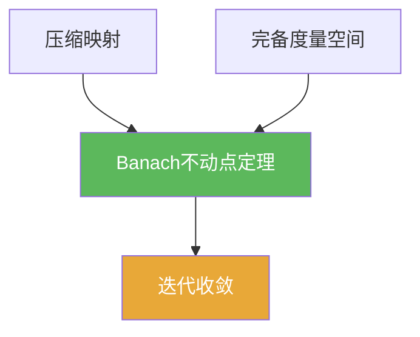

# Banach不动点定理

> [!abstract] 概述
> ==Banach 不动点定理==（又称压缩映射原理）是泛函分析中最常用的存在唯一性工具之一：在完备度量空间中，压缩映射必有唯一不动点，且迭代法收敛。

## 定理表述

> [!def] 定理（压缩映射原理）
> 设 $(X,d)$ 为==完备度量空间==，$T:X\to X$ 为压缩映射（存在 $0<a<1$ 使 $d(Tx,Ty)\le a\,d(x,y)$）。  
> 则：
> 1) 存在唯一 $x^*\in X$ 使 $Tx^*=x^*$；  
> 2) 对任意 $x_0\in X$，迭代 $x_{n+1}=Tx_n$ 收敛到 $x^*$。

## 核心性质（命题工具箱）

| 性质/命题 | 表述（可直接引用） | 用途（做题时怎么用） |
|------|------|------|
| 唯一性一行证明 | 若 $Tx=x,Ty=y$，则 $d(x,y)=d(Tx,Ty)\le a\,d(x,y)$，推出 $x=y$ | 做唯一性时几乎总是直接套这一行 |
| 迭代构造性 | $x_{n+1}=Tx_n$ 在任意初值下收敛到 $x^*$ | 给出“存在+可计算逼近” |
| 误差估计 | $d(x_n,x^*)\le \frac{a^n}{1-a}\,d(x_1,x_0)$ | 估计迭代收敛速度与停止准则 |

## 典型例子与非例子

| 类型 | 例子 | 提醒 |
|---|---|---|
| 典型 | $\mathbb{R}$ 上 $T(x)=\frac12 x$ | $a=1/2$，唯一不动点为 0 |
| 典型 | Banach 空间中 $\|T\|<1$ 的线性算子 | 常用算子范数判别是否为收缩 |
| 非例子 | $T(x)=x+1$（在 $\mathbb{R}$ 上） | 不收缩且无不动点 |

## 关系网络

## 章节扩展

### 第01章：度量空间

- 1.1：主线证明与应用入口：[[1.1 压缩映射原理#二、核心思想]]

## 补充

> [!info] 常见误区与来源
>
> - 误区：只要是 Lipschitz（常数 $a\le 1$）就一定有不动点。收缩需要 $a<1$；$a=1$ 时结论可能失败。  
> - 误区：忽略完备性。迭代往往先证明为 Cauchy，但极限是否在空间内取决于完备性。
>
> **参考（权威外链）**
> - Emory Notes: Contraction Mapping Principle: http://www.math.emory.edu/~gliang7/CMP.pdf
> - CUHK Chapter 3 Contraction Mapping Principle: https://www.math.cuhk.edu.hk/course_builder/2425/math3060/Chapter%203%20Contraction%20Mapping%20Prinicple%202024.pdf

## 参见

- [[压缩映射]]
- [[不动点]]
