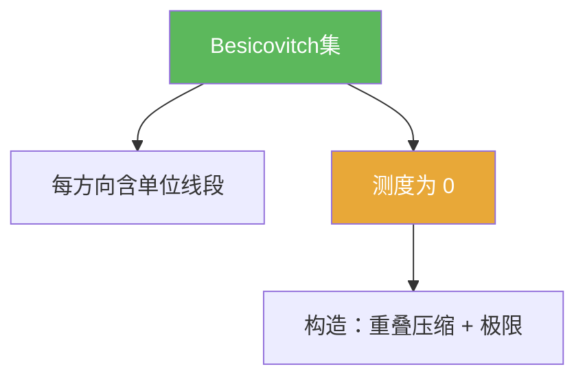

# Besicovitch定理

> [!abstract] 概述
> 本章中的 ==Besicovitch 定理==给出一个强反直觉存在性结论：  
> 在平面中存在测度为 0 的 Besicovitch/Kakeya 集，却仍包含“每个方向的一条单位线段”。  
> 该结论更像“结构型存在性”而非计算定理：你需要掌握的是定义与构造框架，而不是所有几何细节。

## 定理表述

> [!thm] Besicovitch 定理（存在性，平面）
> 存在集合 $E\subset\mathbb{R}^2$，满足：
> 1) 对任意方向 $v$，存在长度为 1 的线段 $I_v$ 平行于 $v$ 且 $I_v\subset E$；  
> 2) $E$ 的 Lebesgue 测度为 0（或：对任意 $\varepsilon>0$ 可取 $m(E)<\varepsilon$）。

## 核心性质（命题工具箱）

| 性质/命题 | 表述（可直接引用） | 用途（做题时怎么用） |
|---|---|---|
| 方向全覆盖但测度 0 | “每方向含单位线段”与“测度为 0”可共存 | 作为反例/反直觉：几何覆盖不推出面积大 |
| 构造三步框架 | 方向离散化 → 重排折叠造成高度重叠 → 取极限稠密化方向 | 复述证明思路/写作型题目 |
| Kakeya 现象入口 | 高维 Kakeya 集与调和分析相关（此处仅做入口） | 提供进一步阅读方向 |

## 关系网络

## 章节扩展

### 第04章：Baire纲定理的应用

- 定义与构造框架：[[4.5 Besicovitch集#二、核心思想]]
- 延伸性讨论：[[4.7 问题#四、习题精选]]

## 补充

> [!info] 阅读建议
> 本节在本书中定位是“反直觉示例”。若想深入，可从 Kakeya 猜想与调和分析中的 Kakeya 估计开始。
>
> **参考（权威外链）**
> - https://en.wikipedia.org/wiki/Kakeya_set
> - https://encyclopediaofmath.org/wiki/Besicovitch_set

## 参见

- [[Besicovitch集]]

