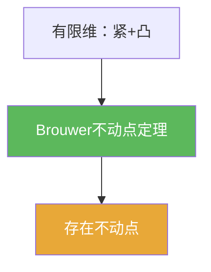

# Brouwer不动点定理

> [!abstract] 概述
> ==Brouwer 不动点定理==是有限维情形的不动点存在定理：连续映射把紧凸集映到自身时必有不动点。它常作为 Schauder 定理的有限维原型。

## 定理表述（常用版本）

> [!def] 定理
> 若 $K\subset \mathbb{R}^n$ 为非空、紧、凸集，且 $T:K\to K$ 连续，则存在 $x\in K$ 使得 $Tx=x$。

## 核心性质（命题工具箱）

| 性质/命题 | 表述（可直接引用） | 用途（做题时怎么用） |
|------|------|------|
| 只保证存在 | Brouwer 只保证存在，不保证唯一性 | 若题目要唯一性，通常需额外收缩/单调性等条件 |
| 有限维紧性优势 | 在 $\mathbb{R}^n$ 中闭有界 $\Rightarrow$ 紧（Heine–Borel） | 应用时常把“紧”替换成“闭有界”以简化验证 |
| 凸性角色 | 凸性排除“洞”，是拓扑证明的关键假设之一 | 检查可行域是否凸往往是第一步 |

## 典型例子与非例子

| 类型 | 例子 | 提醒 |
|---|---|---|
| 典型 | 单位球/单纯形上的连续自映射 | Brouwer 的经典应用场景 |
| 非例子 | 去掉凸性（如环形区域） | 连续自映射可能没有不动点 |
| 非例子提醒 | 无限维闭单位球 | 不能直接用 Brouwer，通常需 Schauder 等替代 |

## 关系网络

## 章节扩展

### 第01章：度量空间

- 1.5：作为“不靠收缩也能有不动点”的代表：[[1.5 凸集与不动点#二、核心思想]]

## 补充

> [!info] 常见误区与来源
>
> - 误区：把 Brouwer 当作“所有连续映射都有不动点”。定理需要“紧+凸+自映射”，缺一不可。  
> - 误区：把无限维情形也套用 Brouwer。无限维里紧性机制不同，通常要用 Schauder（紧映射）等工具。
>
> **参考（权威外链）**
> - Harvard Notes Chapter 12 (Brouwer Fixed Point Theorem): https://math.harvard.edu/archive/101_spring_05/Readings/Notes12.pdf
> - Wikipedia: Brouwer fixed-point theorem: https://en.wikipedia.org/wiki/Brouwer_fixed-point_theorem

## 参见

- [[Schauder不动点定理]]
- [[Banach不动点定理]]
