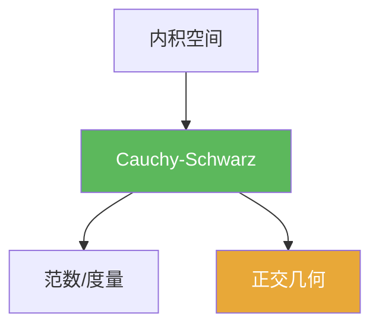

# Cauchy-Schwarz不等式

> [!abstract] 概述
> ==Cauchy–Schwarz 不等式==是内积空间的核心不等式：它把内积与范数联系起来，进而推出三角不等式与内积连续性，是 Hilbert 空间几何的基础。

## 定理表述

> [!def] 定理
> 在内积空间 $H$ 中，对任意 $x,y\in H$，
> $$|\langle x,y\rangle|\le \|x\|\,\|y\|.$$

## 核心性质（命题工具箱）

| 性质/命题 | 表述（可直接引用） | 用途（做题时怎么用） |
|------|------|------|
| 范数良定 | 由 $|\langle x,y\rangle|\le\|x\|\|y\|$ 可推出 $\|x+y\|\le \|x\|+\|y\|$ | 证明内积诱导范数满足三角不等式 |
| 等号条件 | 等号成立当且仅当 $x,y$ 线性相关 | 做“最值/极值”题时用于判断最优情形 |
| 连续性估计 | $|\langle x,y\rangle|\le\|x\|\|y\|$ 是最基本的连续性上界 | 控制内积项、估计误差、证明收敛 |

## 典型例子与非例子

| 类型 | 例子 | 提醒 |
|---|---|---|
| 典型 | $\mathbb{R}^n$：$|x\cdot y|\le \|x\|_2\|y\|_2$ | 最直观的欧氏空间版本 |
| 典型 | $L^2$：$|\int f\overline g|\le \|f\|_2\|g\|_2$ | 是 Hilbert 空间理论的基础估计 |
| 非例子提醒 | 在非内积空间里不一定有 C–S 形式 | 该不等式依赖内积结构，不是任意范数都成立 |

## 关系网络

## 章节扩展

### 第01章：度量空间

- 1.6：内积空间基础性质：[[1.6 内积空间#二、核心思想]]

## 补充

> [!info] 常见误区与来源
>
> - 误区：把 C–S 当作“仅在 $\mathbb{R}^n$ 成立”。它对任意内积空间成立，是泛函分析的通用工具。  
> - 误区：忘记等号条件（线性相关），导致最值题的“取到”条件判断错误。
>
> **参考（权威外链）**
> - IITG MA641 lecture notes（Hilbert 空间工具链）：https://fac.iitg.ac.in/rksri/MA641%20Operator%20Theory%20in%20Hilbert%20Spaces%20lecturenotes%202020.pdf
> - Wikipedia: Cauchy–Schwarz inequality: https://en.wikipedia.org/wiki/Cauchy%E2%80%93Schwarz_inequality

## 参见

- [[内积空间]]
- [[正交]]
