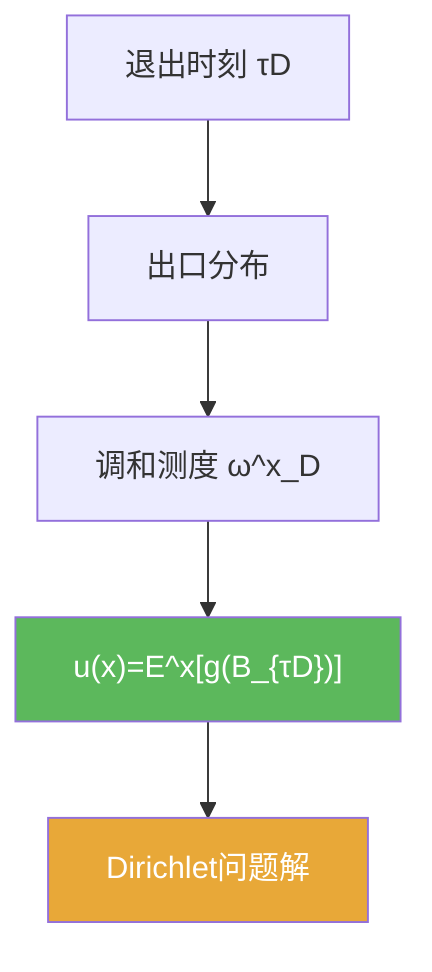

# Dirichlet问题的概率表示定理

> [!abstract] 概述
> 本定理给出 Dirichlet 问题的“概率解”：区域内的解等于边界数据在 Brownian 退出点处的期望。  
> 它把 PDE 的边界值问题连接到停时与出口分布（调和测度）。

## 定理表述（提示性）

> [!thm] 概率表示（提示性表述）
> 设 $D\subset\mathbb R^d$，$\tau_D=\inf\{t:B_t\notin D\}$。在适当条件下，若 $g$ 为边界数据，则
> $$u(x)=\mathbb E^x[g(B_{\tau_D})]$$
> 给出 Dirichlet 问题的解（$u$ 在 $D$ 内调和且满足边界条件）。

## 核心性质（命题工具箱）

| 要点 | 表述 | 用途 |
|---|---|---|
| 出口分布 | $B_{\tau_D}$ 的分布是调和测度 $\omega_D^x$ | 把 $u$ 写成边界平均 |
| 强 Markov 支撑 | $\tau_D$ 是停时，可在退出时刻条件化 | 做分解/拼接计算 |
| 唯一性工具 | 最大值原理常给唯一性 | 证明“候选解即解” |

## 关系网络

## 章节扩展

### 第06章：Brownian运动引论

- 概率表示主线：[[6.6 Dirichlet问题的解#二、核心思想]]
- 停时工具箱：[[6.5 停时和强Markov性质#二、核心思想]]

## 补充

> [!info] 参考（权威外链）
> - https://en.wikipedia.org/wiki/Dirichlet_problem
> - https://en.wikipedia.org/wiki/Harmonic_measure

## 参见

- [[Dirichlet问题]]
- [[调和测度]]
- [[强Markov性质]]

