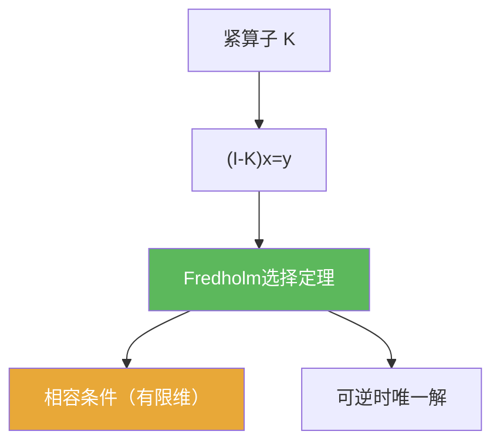

# Fredholm选择定理

> [!abstract] 概述
> ==Fredholm 选择（替代）==描述 $I-K$ 型方程的可解性结构：  
> 要么对所有右端都可解；要么齐次方程存在非零解，并且非齐次方程需要满足有限维相容条件。

## 定理表述

> [!def] 定理（$I-K$ 型的二选一）
> 设 $X$ 为 Banach 空间，$K\in B(X)$ 为紧算子。对方程
> $$(I-K)x=y,$$
> 有如下典型“二选一”结构：
> - 要么 $(I-K)$ 可逆，从而对任意 $y$ 存在唯一解；  
> - 要么齐次方程 $(I-K)x=0$ 有非零解，并且非齐次方程可解当且仅当 $y$ 满足与余核相关的相容条件。

## 核心性质（命题工具箱）

| 性质/命题 | 表述（可直接引用） | 用途（做题时怎么用） |
|------|------|------|
| 可解性模板 | “可逆/不可逆”两种情形给出完全不同的解结构 | 做题先判定是否存在非零核 |
| 相容条件是有限维的 | 不可解的原因来自有限维障碍（余核） | 常把条件写成“对某些泛函为 0”或“对某些解正交” |
| 与谱的联系 | 对 $K-\lambda I$，可改写为 $I-\lambda^{-1}K$ 并套用本定理 | 用于证明紧算子非零谱点为特征值 |

## 关系网络

## 章节扩展

### 第03章：紧算子与Fredholm算子

- 3.2：作为 Riesz–Fredholm 理论的“可解性表述”：[[3.2 Riesz-Fredholm理论#二、核心思想]]
- 3.5：在椭圆方程应用中出现：[[3.5 对椭圆型方程的应用#二、核心思想]]

## 补充

> [!info] 来源
> - Berkeley notes: Compact operators and Fredholm alternative: https://math.berkeley.edu/~evans/Math206A/compact.pdf

## 参见

- [[Riesz-Fredholm定理]]
- [[紧算子]]
- [[Fredholm算子]]
