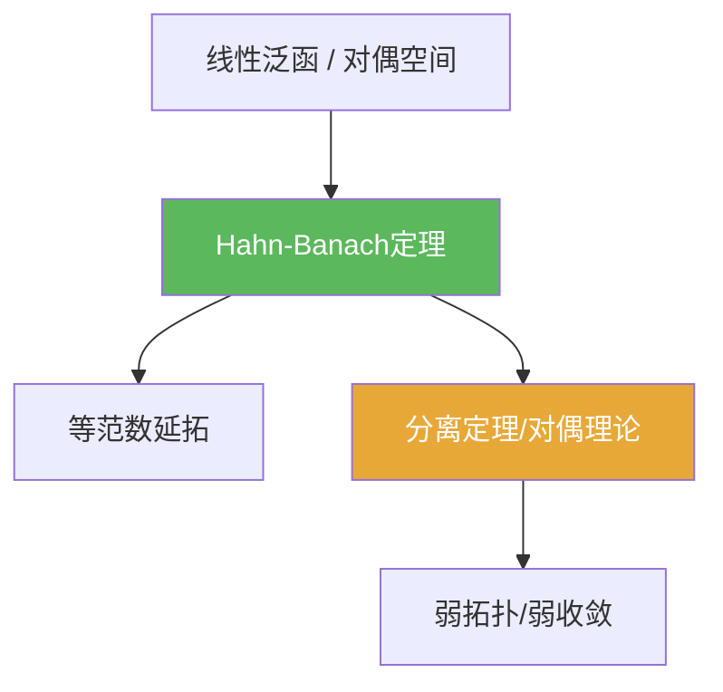

# Hahn-Banach定理

> [!abstract] 概述
> Hahn–Banach 定理保证：子空间上的有界线性泛函可以等范数延拓到全空间。它是对偶理论与分离定理的基础，也是弱拓扑（2.5）的逻辑起点。

## 定理表述

> [!def] 定理（等范数延拓）
> 设 $X$ 为赋范空间，$M\subset X$ 为线性子空间，$f:M\to\mathbb{F}$ 为有界线性泛函。则存在 $F:X\to\mathbb{F}$ 使：
> 1) $F|_M=f$；2) $\|F\|=\|f\|$。

## 核心性质（命题工具箱）

| 性质/命题 | 表述（可直接引用） | 用途（做题时怎么用） |
|------|------|------|
| 分离点 | 对任意 $x\ne 0$，可构造 $f\in X^*$ 使 $f(x)\ne 0$ | 证明“对偶够大”、构造测试泛函 |
| 支撑/分离入口 | 在额外凸性假设下，可推出支撑超平面与分离定理 | 处理凸集与对偶优化问题的基础 |
| 弱拓扑基础 | 弱拓扑用 $X^*$ 作为测试族：$x_n\rightharpoonup x \iff \forall f\in X^*: f(x_n)\to f(x)$ | 第二章弱收敛工具链的逻辑起点 |

## 关系网络

## 章节扩展

### 第02章：线性算子与线性泛函

- 2.4：主线证明与典型应用：[[2.4 Hahn-Banach定理#二、核心思想]]
- 2.5：对偶空间作为弱拓扑的测试集合：[[2.5 共轭空间 弱收敛 自反空间#二、核心思想]]

## 补充

> [!info] 常见误区与来源
>
> - 误区：把 Hahn–Banach 误用为“任意映射都可延拓”。HB 延拓的是**线性泛函**，并保持范数控制。  
> - 误区：忽略实/复版本差异；复情形通常通过实情形或额外论证得到。
>
> **参考（权威外链）**
> - MIT 18.102 Lecture 5 (Hahn–Banach): https://ocw.mit.edu/courses/18-102-introduction-to-functional-analysis-spring-2021/06f9cf855f9f5eaa1898f3e684e05cec_MIT18_102s21_lec5.pdf  
> - UZH Functional Analysis Lecture 6: https://www.math.uzh.ch/gorodnik/fa/lecture6.pdf
> - Wikipedia: Hahn–Banach theorem: https://en.wikipedia.org/wiki/Hahn%E2%80%93Banach_theorem

## 参见

- [[线性泛函]]
- [[共轭空间]]
