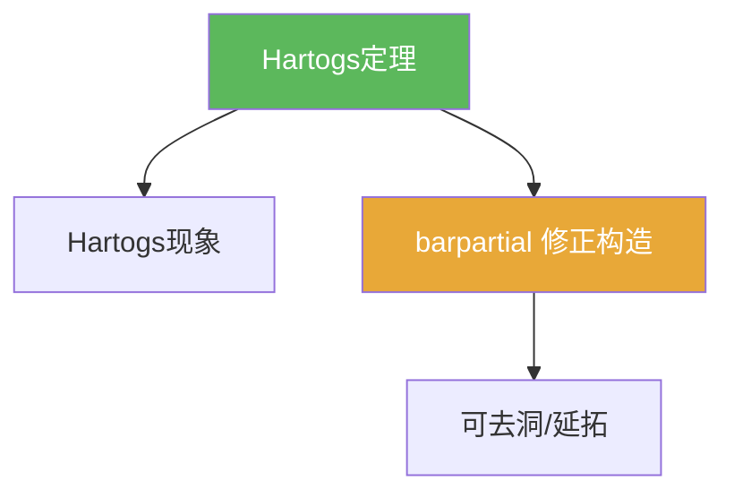

# Hartogs定理（延拓定理）

> [!abstract] 概述
> ==Hartogs 定理==把“可去洞现象”系统化：在 $n\ge 2$ 的多复变中，满足教材条件的穿孔域上全纯函数可以延拓到填洞后的域。  
> 证明的标准套路是“截断 + 解 $\bar\partial$ 修正”。

## 定理表述（提示性）

> [!thm] Hartogs定理（提示性表述）
> 在 $n\ge 2$ 的适当情形下，若 $f$ 在穿孔域 $\Omega\setminus K$ 上全纯（$K$ 为教材规定的“可去”缺失集合），则存在全纯函数 $F$ 在 $\Omega$ 上满足 $F=f$ 于 $\Omega\setminus K$。

## 命题工具箱

| 要点 | 表述 | 用途 |
|---|---|---|
| 维数门槛 | $n\ge 2$ 是现象发生的关键条件 | 对比一复变奇点理论 |
| 证明骨架 | 取截断 $\chi$，解 $\bar\partial u=\bar\partial(\chi f)$，令 $F=\chi f-u$ | 写作型证明模板 |
| 唯一性 | 延拓若存在通常唯一 | 收口与断链防止 |

## 关系网络

## 章节扩展

### 第07章：多复变引论

- 例子与直觉：[[7.2 Hartogs现象 一个例子#二、核心思想]]
- 工具化证明：[[7.3 Hartogs定理 非齐次Cauchy-Riemann方程#二、核心思想]]

## 补充

> [!info] 参考（权威外链）
> - https://en.wikipedia.org/wiki/Hartogs%27_theorem

## 参见

- [[Hartogs现象]]
- [[barpartial算子]]

