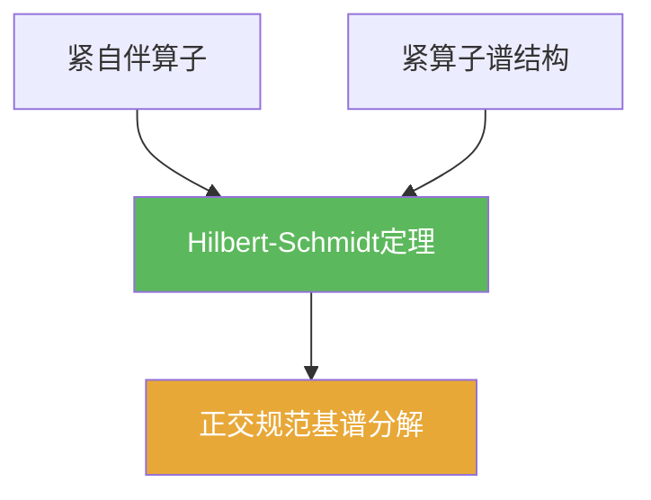

# Hilbert-Schmidt定理

> [!abstract] 概述
> 在 Hilbert 空间上，紧自伴算子可以用“正交规范基”做谱分解（类似矩阵对角化）。  
> 这把第03章紧算子谱结构进一步几何化，是 Hilbert 场景下的核心结论之一。

## 定理表述

> [!def] 定理（紧自伴算子谱分解）
> 设 $H$ 为 Hilbert 空间，$T:H\to H$ 为紧自伴算子。则存在 $H$ 的一组正交规范基，由 $T$ 的特征向量组成；并且 $T$ 的非零特征值至多可数，且只可能聚到 $0$。

## 核心性质（命题工具箱）

| 性质/命题 | 表述（可直接引用） | 用途（做题时怎么用） |
|------|------|------|
| 正交性 | 不同特征值对应的特征向量正交 | 构造正交系与基的第一步 |
| 对角化直觉 | 在某个正交规范基下 $Te_n=\lambda_n e_n$ 且 $\lambda_n\to 0$ | 把算子问题变成序列问题 |
| 与紧谱定理关系 | 这是“紧算子谱定理”在 Hilbert 自伴情形的强化 | 做题时先检查自伴性以获得更强结构 |

## 关系网络

## 章节扩展

### 第03章：紧算子与Fredholm算子

- 3.4：Hilbert 场景下的谱分解：[[3.4 Hilbert-Schmidt定理#二、核心思想]]

## 补充

> [!info] 来源
> - Oxford notes (compact self-adjoint operators): https://people.maths.ox.ac.uk/porterm/FunctionalAnalysis/compact_selfadjoint.pdf

## 参见

- [[Hilbert-Schmidt算子]]
- [[紧算子谱定理]]
- [[紧算子]]
