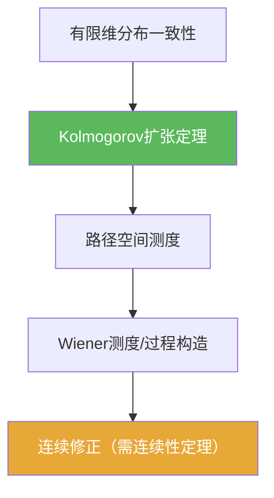

# Kolmogorov扩张定理

> [!abstract] 概述
> ==Kolmogorov 扩张定理==把“一致的有限维分布”提升为“路径空间上的概率测度”，从而在分布层面构造随机过程。  
> 在 6.3 的 Brownian 构造中，它负责“先有测度”这一步。

## 定理表述（提示性）

> [!thm] Kolmogorov扩张定理（口径提示）
> 若对每个有限指标集给定联合分布，并且这些联合分布在边缘化下彼此相容（满足一致性），则存在一个概率空间与过程 $\{X_t\}$ 使其所有有限维分布与给定者一致。

## 核心性质（命题工具箱）

| 要点 | 表述（可直接引用） | 用途（做题时怎么用） |
|---|---|---|
| 输入是“一致性” | 边缘化与低维分布一致 | 检验能否拼成过程 |
| 输出是“存在测度/过程” | 存在路径空间测度使坐标过程符合给定有限维分布 | 构造随机过程（先分布后路径） |
| 不保证路径正则性 | 仅给出分布存在性 | 还需连续性定理拿到连续修正 |

## 关系网络

## 章节扩展

### 第06章：Brownian运动引论

- 构造主线：[[6.3 Brownian运动的构造#二、核心思想]]
- 技巧准备：[[6.2 技巧准备#二、核心思想]]

## 补充

> [!info] 参考（权威外链）
> - https://en.wikipedia.org/wiki/Kolmogorov_extension_theorem

## 参见

- [[Kolmogorov连续性定理]]
- [[Wiener测度]]

