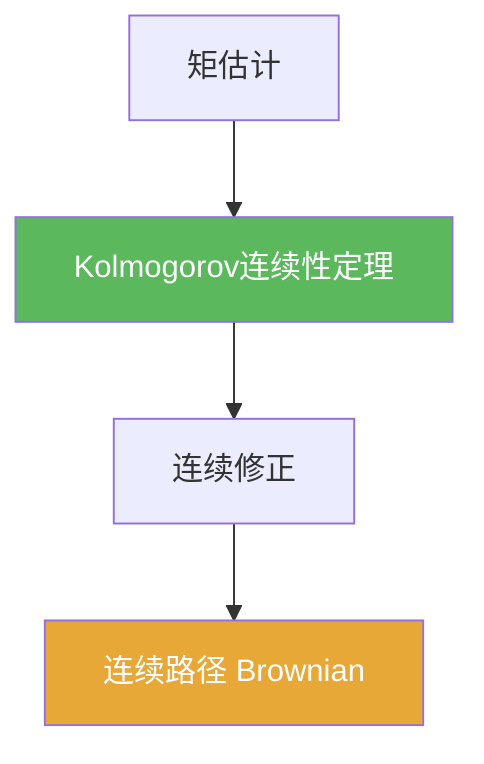

# Kolmogorov连续性定理

> [!abstract] 概述
> ==Kolmogorov 连续性定理==把“增量的矩估计”升级为“存在 Hölder 连续（因此连续）的修正”。  
> 在 Brownian 构造中，它负责把扩张定理给出的某个版本提升为连续路径版本。

## 定理表述（提示性）

> [!thm] Kolmogorov连续性定理（口径提示）
> 若存在 $p>0,\alpha>0,C>0$ 使对所有 $s,t$，
> $$\mathbb E|X_t-X_s|^p\le C|t-s|^{1+\alpha},$$
> 则过程存在 Hölder 连续修正（从而存在连续修正）。

## 核心性质（命题工具箱）

| 要点 | 表述（可直接引用） | 用途（做题时怎么用） |
|---|---|---|
| 输入是矩估计 | 增量的 $p$ 阶矩随 $|t-s|$ 有足够衰减 | 只做估计，不做构造 |
| 输出是“存在修正” | 存在更好的版本（Hölder 连续） | 解决路径连续性 |
| 对 Brownian 的应用 | $\mathbb E|B_t-B_s|^p\asymp |t-s|^{p/2}$，取 $p>2$ 即可 | 给出连续版本的标准理由 |

## 关系网络

## 章节扩展

### 第06章：Brownian运动引论

- 技巧准备与定理使用：[[6.2 技巧准备#二、核心思想]]
- 构造中出现的位置：[[6.3 Brownian运动的构造#二、核心思想]]

## 补充

> [!info] 参考（权威外链）
> - https://en.wikipedia.org/wiki/Kolmogorov_continuity_theorem

## 参见

- [[Kolmogorov扩张定理]]
- [[Brownian运动]]

