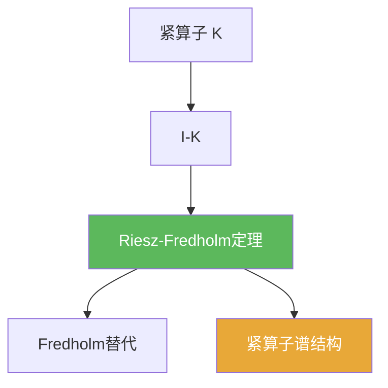

# Riesz-Fredholm定理

> [!abstract] 概述
> 对紧算子 $K$，算子 $I-K$ 的不可逆性只能以“有限维障碍”方式出现。  
> 这使得可解性、核/余核结构与指数概念都变得可控，是第03章的核心引擎。

## 定理表述

> [!def] 定理（典型口径）
> 设 $X$ 为 Banach 空间，$K\in B(X)$ 为紧算子。则 $I-K$ 满足：
> 1) $\dim\ker(I-K)<\infty$；  
> 2) $\operatorname{Ran}(I-K)$ 闭且余维有限；  
> 3) 存在 Fredholm 替代式的可解性二选一结构（见 [[Fredholm选择定理]])。

## 核心性质（命题工具箱）

| 性质/命题 | 表述（可直接引用） | 用途（做题时怎么用） |
|------|------|------|
| 有限维障碍 | $\ker(I-K)$ 有限维，且 $\operatorname{codim}\operatorname{Ran}(I-K)<\infty$ | 解方程时只需处理有限维相容条件 |
| 典型模型 | $I-K$ 是 Fredholm 算子的经典来源 | 把“紧性”转化为 Fredholm 结构（见 [[Fredholm算子]]) |
| 通往谱论 | 对 $\lambda\ne 0$，研究 $K-\lambda I$ 可改写为 $I-\lambda^{-1}K$ | 3.3 中“非零谱点是特征值”的关键入口 |

## 关系网络

## 章节扩展

### 第03章：紧算子与Fredholm算子

- 3.2：主定理与证明套路：[[3.2 Riesz-Fredholm理论#二、核心思想]]
- 3.3：谱结构推导入口：[[3.3 紧算子的谱理论#二、核心思想]]

## 补充

> [!info] 常见误区与来源
>
> - 误区：把它当作“任意 $I-T$ 都可用”。紧性是关键假设。  
> - 误区：忽略 Banach（完备性）环境，导致证明链条中 Cauchy 收尾失败。
>
> **参考（权威外链）**
> - Berkeley notes: Compact operators and Fredholm alternative: https://math.berkeley.edu/~evans/Math206A/compact.pdf

## 参见

- [[Fredholm选择定理]]
- [[紧算子谱定理]]
- [[Fredholm算子]]
