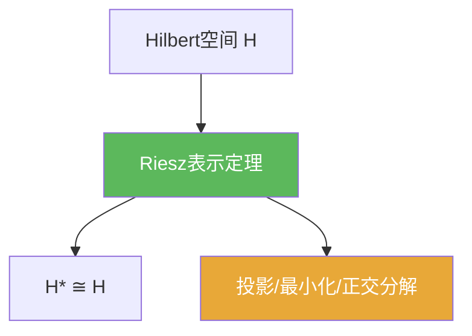

# Riesz表示定理

> [!abstract] 概述
> 在 Hilbert 空间中，每个连续线性泛函都能被一个向量“表示”：$\varphi(x)=\langle x,y\rangle$。这让 $H^\*$ 与 $H$ 等距同构，是 Hilbert 理论中最核心的对偶桥梁。

## 定理表述

> [!def] 定理（Hilbert 空间的 Riesz 表示）
> 设 $H$ 为 Hilbert 空间，$\varphi\in H^\*$。则存在唯一 $y\in H$ 使对任意 $x\in H$，
> $$\varphi(x)=\langle x,y\rangle,$$
> 并且 $\|\varphi\|=\|y\|$。

## 核心性质（命题工具箱）

| 性质/命题 | 表述（可直接引用） | 用途（做题时怎么用） |
|------|------|------|
| 唯一性 | 若 $\langle x,y_1\rangle=\langle x,y_2\rangle$ 对所有 $x$ 成立，则 $y_1=y_2$ | 证明“表示向量唯一”时的标准一句话 |
| 等距同构 | $J:H\to H^*$，$J(y)(x)=\langle x,y\rangle$ 是等距同构，且 $\|J(y)\|=\|y\|$ | 把对偶问题具体化为向量问题（可计算） |
| 正交/最小化入口 | 许多极值/最佳逼近问题可转化为正交条件 | 与投影定理、最小二乘、谱理论密切相关 |

## 关系网络

## 章节扩展

### 第02章：线性算子与线性泛函

- 2.2：主线证明与应用入口：[[2.2 Riesz表示定理及其应用#二、核心思想]]

## 补充

> [!info] 常见误区与来源
>
> - 误区：把 Riesz 表示当作“任意 Banach 空间都成立”。它依赖 Hilbert 的内积结构（以及完备性）。  
> - 误区：忽略实/复内积空间的线性约定（第一变量线性或第二变量线性），导致公式细节出错。
>
> **参考（权威外链）**
> - UChicago REU paper (Adler): http://math.uchicago.edu/~may/REU2021/REUPapers/Adler.pdf  
> - Georgia Tech lecture notes: https://mccuan.math.gatech.edu/courses/6702/covidlecture22.pdf

## 参见

- [[Hilbert空间]]
- [[线性泛函]]
- [[共轭空间]]
