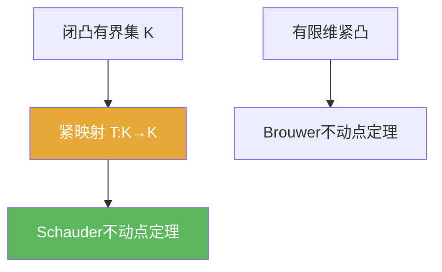

# Schauder不动点定理

> [!abstract] 概述
> ==Schauder 不动点定理==把 Brouwer 的有限维结果推广到无限维：用“紧性（紧映射/完全连续映射）”替代“有限维紧性”，从而得到不动点存在性。

## 定理表述（常用口径）

> [!def] 定理（常见表述之一）
> 设 $X$ 为 Banach 空间，$K\subset X$ 为非空、闭、凸、有界集。若 $T:K\to K$ 是**紧映射**（$T(K)$ 相对紧）且连续，则存在 $x\in K$ 使 $Tx=x$。

## 核心性质（命题工具箱）

| 性质/命题 | 表述（可直接引用） | 用途（做题时怎么用） |
|------|------|------|
| 存在但不唯一 | Schauder 一般只保证存在，不保证唯一 | 若需唯一性通常回到收缩/单调性框架 |
| “紧映射”是关键 | 要求 $T(K)$ 相对紧（预紧）以获得紧性机制 | 无穷维里用“紧映射”替代“有限维紧性” |
| 与 Brouwer 的关系 | 有限维时紧性自动出现，Schauder 退化为 Brouwer 思路 | 做题时可先检查是否有限维/是否紧映射 |

## 典型例子与非例子

| 类型 | 例子 | 提醒 |
|---|---|---|
| 典型 | 许多积分算子在闭凸有界集上是紧映射 | 常用于 ODE/PDE 的存在性 |
| 非例子提醒 | 仅连续但不紧的映射 | 一般不能保证不动点存在 |

## 关系网络

## 章节扩展

### 第01章：度量空间

- 1.5：在压缩映射之外的存在性工具：[[1.5 凸集与不动点#二、核心思想]]

## 补充

> [!info] 常见误区与来源
>
> - 误区：把“连续”当作充分条件。在无限维中连续并不足以保证不动点；需要紧性机制（紧映射/相对紧像）。  
> - 误区：把“紧映射”理解成“$\|Tx\|$ 有界”。紧映射强调像集相对紧（能抽收敛子列）。
>
> **参考（权威外链）**
> - Waterloo AMATH731 Lecture 09 (Schauder fixed-point theorem): https://uwaterloo.ca/scholar/sites/ca.scholar/files/g6tran/files/amath731_lecture09.pdf
> - Wikipedia: Schauder fixed-point theorem: https://en.wikipedia.org/wiki/Schauder_fixed-point_theorem

## 参见

- [[Brouwer不动点定理]]
- [[紧集]]
