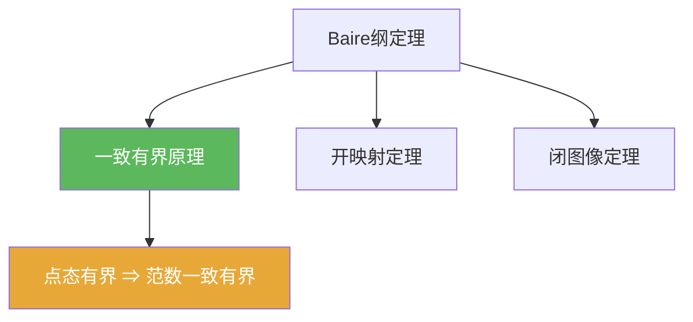

# 一致有界原理

> [!abstract] 概述
> ==一致有界原理==（Banach–Steinhaus）是 Baire 方法的典型输出：  
> 在 Banach 空间上，若一族有界线性算子对每个点都“点态有界”，则它们的算子范数“统一有界”。  
> 这是“逐点信息 ⇒ 全局一致控制”的范式。

## 定理表述

> [!thm] 一致有界原理
> 设 $X$ 为 Banach 空间，$Y$ 为赋范空间，$\{T_\alpha\}\subset B(X,Y)$。若对每个 $x\in X$，
> $$\sup_\alpha \|T_\alpha x\|<\infty,$$
> 则
> $$\sup_\alpha \|T_\alpha\|<\infty.$$

## 核心性质（命题工具箱）

| 性质/命题 | 表述（可直接引用） | 用途（做题时怎么用） |
|---|---|---|
| 点态→一致 | 点态有界推出 $\sup_\alpha\|T_\alpha\|<\infty$ | 处理“逐点收敛/逐点有界”到“统一估计” |
| $E_n$ 构造 | 令 $E_n=\{x:\sup_\alpha\|T_\alpha x\|\le n\}$，则 $X=\bigcup_n E_n$ 且 $E_n$ 闭 | 复述证明骨架的关键一句 |
| 常见推论 | 若 $T_nx$ 对每个 $x$ 收敛，则 $\sup_n\|T_n\|<\infty$ | 逐点收敛序列的有界性统一化 |

## 关系网络

## 章节扩展

### 第04章：Baire纲定理的应用

- 主线证明与题型模板：[[4.2 一致有界原理#二、核心思想]]
- 训练题：[[4.6 习题#四、习题精选]]

## 补充

> [!info] 量词警告
> 假设是“对每个 $x\in X$ 点态有界”，不是“对某个稠密集”。做题时先检查量词是否满足。
>
> **参考（权威外链）**
> - https://en.wikipedia.org/wiki/Uniform_boundedness_principle
> - https://math.mit.edu/~rbm/18.155-F16/L6.pdf

## 参见

- [[Baire纲定理]]
- [[Banach空间]]
- [[有界线性算子]]
- [[开映射定理]]
- [[闭图像定理]]

