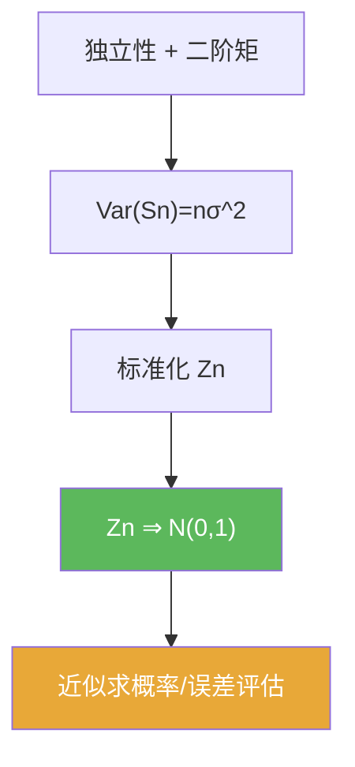

# 中心极限定理

> [!abstract] 概述
> ==中心极限定理==说明：在广泛条件下，独立随机变量的和在中心化与标准化后，会呈现“正态极限”。  
> 在本章的使用姿势是：把题面写成标准化偏差 $Z_n=(S_n-n\mu)/(\sigma\sqrt n)$，再把概率问题改写为 $\mathbb P(Z_n\le t)$ 的极限。

## 定理表述（口径提示）

> [!thm] 中心极限定理（i.i.d. 版本，提示性表述）
> 设 $X_1,X_2,\dots$ 为 i.i.d. 随机变量，$\mathbb E[X_1]=\mu$，$\mathrm{Var}(X_1)=\sigma^2>0$。令 $S_n=\sum_{k=1}^n X_k$，则
> $$\frac{S_n-n\mu}{\sigma\sqrt n}\Rightarrow N(0,1).$$

## 核心性质（命题工具箱）

| 性质/命题 | 表述（可直接引用） | 用途（做题时怎么用） |
|---|---|---|
| 标准化模板 | $Z_n=(S_n-n\mu)/(\sigma\sqrt n)$ | 题面改写的第一步 |
| 分布收敛 | $Z_n\Rightarrow N(0,1)$ | 适合求区间概率/尾概率的极限 |
| Bernoulli 特例 | $X_k\sim\mathrm{Bernoulli}(p)$ ⇒ $(S_n-np)/\sqrt{np(1-p)}\Rightarrow N(0,1)$ | 5.1 的经典模型 |

## 关系网络

## 章节扩展

### 第05章：概率论基础

- 5.1：Bernoulli 模型下的标准化偏差：[[5.1 Bernoulli试验#二、核心思想]]
- 5.2：一般独立随机变量部分和的 CLT 入口：[[5.2 独立随机变量的和#二、核心思想]]

## 补充

> [!info] 常见误区
> CLT 是“分布收敛”，不是“几乎处处收敛”。若题目问 $\mathbb P(S_n\le a_n)$ 的极限，必须先把它改写成标准化变量的分布函数极限。
>
> **参考（权威外链）**
> - https://en.wikipedia.org/wiki/Central_limit_theorem

## 参见

- [[大数定律]]
- [[方差]]
- [[独立性]]

