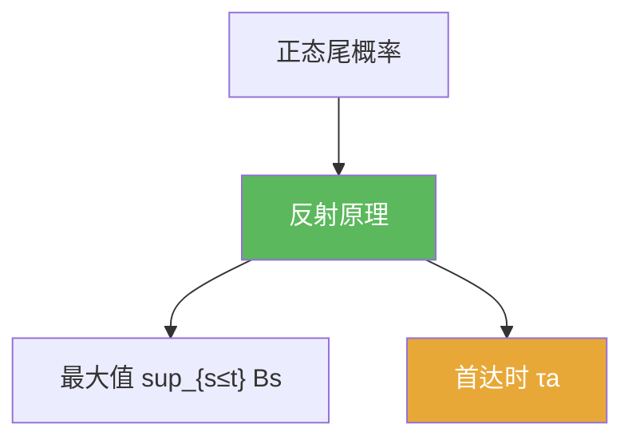

# 反射原理

> [!abstract] 概述
> ==反射原理==是 Brownian 运动最强的“路径事件→单时刻事件”转换器之一。  
> 它允许你计算最大值、首达时等事件的概率，把问题归约为正态尾概率。

## 定理表述（提示性）

> [!thm] 反射原理（常用形式）
> 对标准 Brownian 运动 $B$ 与 $a>0$，有
> $$\mathbb P\Big(\sup_{0\le s\le t}B_s\ge a\Big)=2\,\mathbb P(B_t\ge a).$$

## 核心性质（命题工具箱）

| 要点 | 表述 | 用途 |
|---|---|---|
| 最大值分布 | 由上式得到 $\sup_{s\le t}B_s$ 的分布 | 最大值/上穿概率 |
| 首达时分布 | $\{\tau_a\le t\}\Leftrightarrow\{\sup_{s\le t}B_s\ge a\}$ | 首达时事件改写 |
| 对称性来源 | 利用高斯对称 + 路径连续 + 反射映射 | 解释“为什么成立” |

## 关系网络

## 章节扩展

### 第06章：Brownian运动引论

- 反射原理主用法：[[6.4 Brownian运动的进一步的性质#二、核心思想]]
- 题型训练：[[6.7 习题#二、核心思想]]

## 补充

> [!info] 参考（权威外链）
> - https://en.wikipedia.org/wiki/Reflection_principle_(Wiener_process)

## 参见

- [[Brownian运动]]
- [[停时]]

