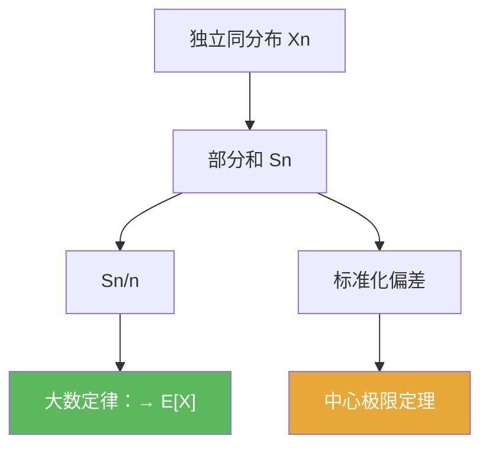

# 大数定律

> [!abstract] 概述
> ==大数定律==把“独立重复试验的平均值”稳定到一个确定常数：样本均值趋于总体均值。  
> 本章的核心使用姿势是：把题面改写成 $S_n/n$，并识别其极限应为 $\mathbb E[X]$。

## 定理表述（口径提示）

> [!thm] 大数定律（i.i.d. 版本，提示性表述）
> 设 $X_1,X_2,\dots$ 为独立同分布随机变量，且 $\mathbb E|X_1|<\infty$。令
> $$S_n=\sum_{k=1}^n X_k.$$
> 则在适当的收敛方式下（以教材为准），有
> $$\frac{S_n}{n}\to \mathbb E[X_1].$$

## 核心性质（命题工具箱）

| 性质/命题 | 表述（可直接引用） | 用途（做题时怎么用） |
|---|---|---|
| 样本均值稳定 | $S_n/n\to \mu$ | 把频率/平均值问题直接换成极限 |
| 需要可积性 | 至少要求 $\mathbb E|X|<\infty$ | 避免“期望不存在”导致误用 |
| 与 CLT 分工 | LLN 给均值层面稳定；CLT 给波动层面极限 | 看到“偏差尺度”就切换到 CLT |

## 关系网络

## 章节扩展

### 第05章：概率论基础

- 5.1：Bernoulli 模型下的频率视角：[[5.1 Bernoulli试验#二、核心思想]]
- 5.2：一般独立随机变量部分和的 LLN 入口：[[5.2 独立随机变量的和#二、核心思想]]

## 补充

> [!info] 常见误区
> LLN 不是“每个 $n$ 都接近”，而是“当 $n$ 很大时趋近”；并且需要明确收敛方式（几乎处处/依概率等）。
>
> **参考（权威外链）**
> - https://en.wikipedia.org/wiki/Law_of_large_numbers

## 参见

- [[中心极限定理]]
- [[独立性]]
- [[期望]]

