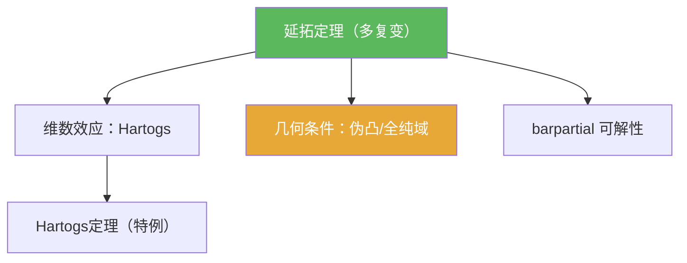

# 延拓定理（多复变）

> [!abstract] 概述
> ==延拓定理==刻画“全纯函数能延拓到多大”。多复变里，延拓的可能性通常由两类因素控制：  
> 1) 维数效应（例如 Hartogs 现象）  
> 2) 域的几何条件（例如与伪凸/全纯域相关的可解性与估计）  
> 本页作为第07章延拓主线的“总节点”，并把典型特例指向 Hartogs 定理。

## 定理表述（提示性）

> [!thm] 延拓定理（提示性表述）
> 在教材给定的条件下，若 $f$ 在某个子域（或穿孔域、或边界满足 CR 条件）上全纯，并且域满足相应的几何/可解性条件，则存在更大域上的全纯函数 $F$ 使得 $F$ 在原区域与 $f$ 一致；且在常见情形下延拓具有唯一性。

## 命题工具箱

| 要点 | 表述 | 用途 |
|---|---|---|
| 延拓的目标 | 找到 $F$ 使得 $F=f$ 于原区域 | 明确“要构造什么” |
| 机制骨架 | “先拼接候选，再用 $\bar\partial$ 修正”是典型套路 | 与 Hartogs 证明同构 |
| 几何开关 | 伪凸/全纯域等条件用于保证可解性，从而保证可延拓 | 先看域再谈结论 |

## 关系网络

## 章节扩展

### 第07章：多复变引论

- 例子与直觉：[[7.2 Hartogs现象 一个例子#二、核心思想]]
- 逼近与延拓的汇合点：[[7.7 逼近和延拓定理#二、核心思想]]

## 补充

> [!info] 参考（权威外链）
> - https://en.wikipedia.org/wiki/Domain_of_holomorphy
> - https://en.wikipedia.org/wiki/Hartogs%27_theorem

## 参见

- [[Hartogs定理（延拓定理）]]
- [[全纯域]]
- [[伪凸域]]
- [[barpartial算子]]
