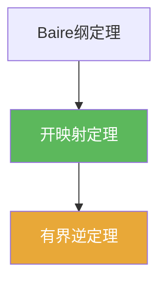

# 开映射定理

> [!abstract] 概述
> 开映射定理表明：在 Banach 空间之间，连续线性满射不会把开集“压扁”，而是把开集映成开集。这一性质等价地给出稳定性估计，并推出有界逆定理。

## 定理表述

> [!def] 定理
> 设 $X,Y$ 为 Banach 空间，$T:X\to Y$ 为连续线性满射，则 $T$ 是开映射：对任意开集 $U\subset X$，$T(U)$ 在 $Y$ 中开。

## 核心性质（命题工具箱）

| 性质/命题 | 表述（可直接引用） | 用途（做题时怎么用） |
|------|------|------|
| 球映球形式 | $\exists r>0:\ B_Y(0,r)\subset T(B_X(0,1))$ | 把“开映射”转成可计算的范数估计形式 |
| 推出有界逆 | 若 $T$ 还是双射，则 $T^{-1}$ 连续（从而有界） | 直接导出有界逆定理（见 [[有界逆定理]]) |
| 稳定性直觉 | 满射不会把开集压扁成“薄集” | 做题时常用于证明“解对数据连续依赖” |

## 关系网络

## 章节扩展

### 第02章：线性算子与线性泛函

- 2.3：开映射定理与闭图像/有界逆的关系：[[2.3 纲与开映射定理#二、核心思想]]

### 第04章：Baire纲定理的应用

- 4.3：球映球版本与有界逆的一行推导：[[4.3 开映射定理#二、核心思想]]

## 补充

> [!info] 常见误区与来源
>
> - 误区：把“线性满射”在任意赋范空间上都当作开映射。定理需要 Banach（完备性）假设。  
> - 误区：把“开映射”当作纯拓扑结论，忽略它等价于一个非常有用的“球映球估计”。
>
> **参考（权威外链）**
> - MIT 18.102 Lecture 4: https://ocw.mit.edu/courses/18-102-introduction-to-functional-analysis-spring-2021/038fc32ab9c1bb63a4f29bd9d7c97961_MIT18_102s21_lec4.pdf  
> - Wikipedia: Open mapping theorem (functional analysis): https://en.wikipedia.org/wiki/Open_mapping_theorem_(functional_analysis)

## 参见

- [[有界逆定理]]
- [[闭图像定理]]
