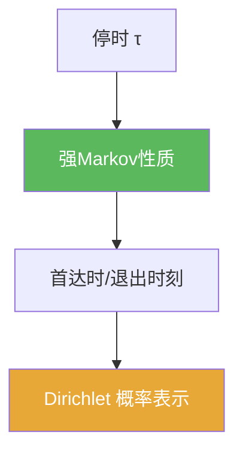

# 强Markov性质

> [!abstract] 概述
> ==强 Markov 性质==把 Markov 的“无记忆”从固定时刻推广到停时：在任意停时 $\tau$ 处，之后的增量过程在条件下仍是同类过程，且与过去独立。  
> 它是 6.5–6.6 的核心发动机。

## 定理表述（提示性）

> [!thm] 强Markov性质（Brownian 口径）
> 设 $B$ 为 Brownian 运动，$\tau$ 为其自然滤过的停时。则条件于 $\mathcal F_\tau$，过程
> $$\widetilde B_t=B_{\tau+t}-B_\tau$$
> 仍为标准 Brownian 且与 $\mathcal F_\tau$ 独立。

## 核心性质（命题工具箱）

| 要点 | 表述 | 用途 |
|---|---|---|
| 重启 | 停时处把过程切成“过去 + 独立未来” | 计算首达时后行为 |
| 退出时刻 | 对 $\tau_D$ 可重启 | Dirichlet 表示中的分解 |
| 停时必要 | 必须满足 $\{\tau\le t\}\in\mathcal F_t$ | 避免“偷看未来” |

## 关系网络

## 章节扩展

### 第06章：Brownian运动引论

- 主线与用法模板：[[6.5 停时和强Markov性质#二、核心思想]]
- Dirichlet 分解用法：[[6.6 Dirichlet问题的解#二、核心思想]]

## 补充

> [!info] 参考（权威外链）
> - https://en.wikipedia.org/wiki/Strong_Markov_property
> - https://mathweb.ucsd.edu/~pfitz/downloads/courses/spring03/math280c/strmark.pdf

## 参见

- [[停时]]
- [[滤过]]

