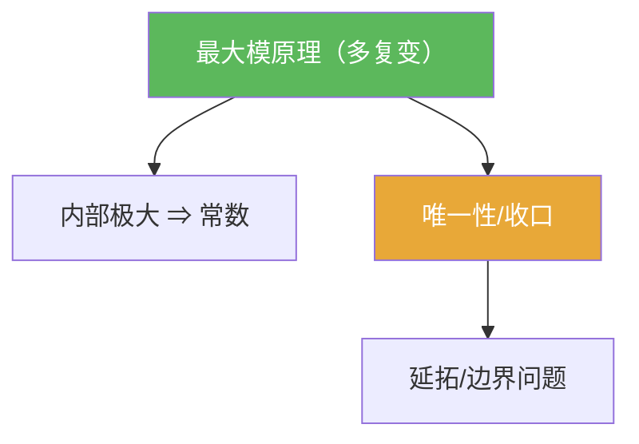

# 最大模原理（多复变）

> [!abstract] 概述
> ==最大模原理==是“收口工具”：对全纯函数而言，若模长在域的内部取得（局部）最大值，则函数被迫为常数。  
> 它常用于唯一性、排除反例、以及把“边界控制”转成“内部结论”。

## 定理表述（提示性）

> [!thm] 最大模原理（提示性表述）
> 设 $\Omega\subset\mathbb C^n$ 为域，$f$ 在 $\Omega$ 上全纯。若存在点 $z_0\in\Omega$ 使得 $|f(z)|\le |f(z_0)|$ 在 $z_0$ 的某邻域内成立，则 $f$ 在 $\Omega$ 上为常数。

## 命题工具箱

| 要点 | 表述 | 用途 |
|---|---|---|
| “内部极大”不可能 | $|f|$ 在内部局部取最大值 $\Rightarrow f$ 常数 | 反证法收口模板 |
| 唯一性推断 | 若两个全纯函数在边界/开集一致，常可借此推出全域一致 | 证明“延拓唯一” |
| 与一维一致 | 口径与一复变最大模原理一致（但应用场景常更依赖几何） | 迁移已有直觉 |

## 关系网络

## 章节扩展

### 第07章：多复变引论

- 结论与使用姿势：[[7.6 最大模原理#二、核心思想]]

## 补充

> [!info] 参考（权威外链）
> - https://en.wikipedia.org/wiki/Maximum_modulus_principle

## 参见

- [[多复变全纯函数]]
- [[全纯域]]
