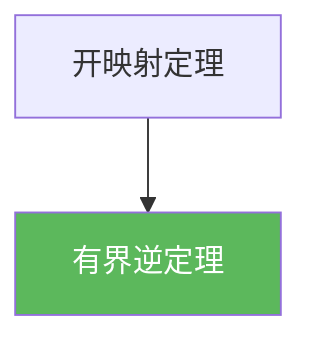

# 有界逆定理

> [!abstract] 概述
> 在 Banach 空间之间，线性双射算子只要是有界的，那么它的逆也自动有界（连续）。这是“可逆性 ⇒ 稳定性”的典型结构定理。

## 定理表述

> [!def] 定理
> 设 $X,Y$ 为 Banach 空间，$T:X\to Y$ 为线性双射且有界，则 $T^{-1}:Y\to X$ 也有界。

## 核心性质（命题工具箱）

| 性质/命题 | 表述（可直接引用） | 用途（做题时怎么用） |
|------|------|------|
| 来源 | 由开映射定理推出：双射 + 开映射 $\Rightarrow$ 逆连续 | 证明时常只需引用开映射定理 |
| 稳定性估计 | $\exists C>0:\ \|T^{-1}y\|\le C\|y\|$ | 解方程 $Tx=y$ 的“连续依赖”与误差控制 |
| 适用条件 | $X,Y$ 必须是 Banach；$T$ 必须有界且双射 | 检查条件缺失时不要误用（非完备可失败） |

## 关系网络

## 章节扩展

### 第02章：线性算子与线性泛函

- 2.3：与开映射/闭图像并列的三件套之一：[[2.3 纲与开映射定理#二、核心思想]]

### 第04章：Baire纲定理的应用

- 4.3：由球映球直接推出逆有界：[[4.3 开映射定理#二、核心思想]]

## 补充

> [!info] 常见误区与来源
>
> - 误区：把“线性双射”当作“逆连续”。在无限维中，线性双射并不自动连续；有界逆定理说明在 Banach 场景下“有界 + 双射”足以推出逆有界。  
> - 误区：忽略完备性。若 $X,Y$ 不完备，该结论可能失败。
>
> **参考（权威外链）**
> - MIT 18.102 Lecture 4: https://ocw.mit.edu/courses/18-102-introduction-to-functional-analysis-spring-2021/038fc32ab9c1bb63a4f29bd9d7c97961_MIT18_102s21_lec4.pdf  
> - Wikipedia: Bounded inverse theorem: https://en.wikipedia.org/wiki/Bounded_inverse_theorem

## 参见

- [[开映射定理]]
- [[闭图像定理]]
