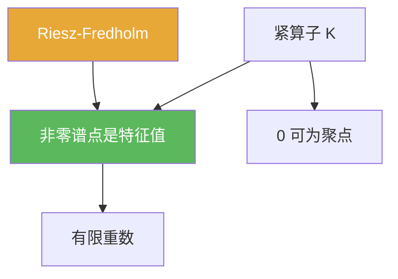

# 紧算子谱定理

> [!abstract] 概述
> 紧算子的谱结构在 Banach 空间上“接近矩阵”：  
> ==非零谱点都是特征值==，且每个特征值重数有限，$0$ 是唯一可能的聚点。

## 定理表述

> [!def] 定理（紧算子谱结构）
> 设 $X$ 为 Banach 空间，$K\in B(X)$ 为紧算子，则：
> 1) 若 $\lambda\ne 0$ 且 $\lambda\in\sigma(K)$，则存在 $x\ne 0$ 使 $Kx=\lambda x$；  
> 2) 对每个 $\lambda\ne 0$，其特征空间有限维；  
> 3) 非零谱点至多可数，且只能向 $0$ 聚集。

## 核心性质（命题工具箱）

| 性质/命题 | 表述（可直接引用） | 用途（做题时怎么用） |
|------|------|------|
| 谱点特征化 | 非零谱点 = 非零特征值 | 避免在紧算子上纠结连续谱，直接找特征值 |
| 圆盘估计结合 | 总有 $\sigma(K)\subset\{|\lambda|\le \|K\|\}$ | 与一般谱估计一致，可快速定位谱范围 |
| 推导入口 | 用 $I-\lambda^{-1}K$ 的 Fredholm 结构证明 | 做证明时把谱问题改写为 $I-$ 型 |

## 关系网络

## 章节扩展

### 第03章：紧算子与Fredholm算子

- 3.3：本定理主应用与推导：[[3.3 紧算子的谱理论#二、核心思想]]

## 补充

> [!info] 来源
> - UC Davis notes (compact operators): https://www.math.ucdavis.edu/~hunter/m125a/compact.pdf

## 参见

- [[紧算子]]
- [[谱]]
- [[Riesz-Fredholm定理]]
