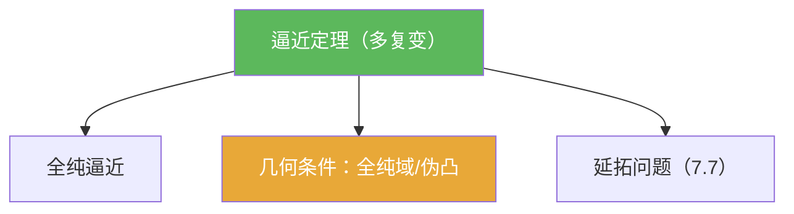

# 逼近定理（多复变）

> [!abstract] 概述
> ==逼近定理==回答“能否用更简单的全纯对象逼近给定全纯函数”。在多复变里，逼近往往与域的几何/凸性条件绑定（例如全纯凸、伪凸、全纯域），并与延拓问题共享同一套工具链。

## 定理表述（提示性）

> [!thm] 逼近定理（提示性表述）
> 在教材给定的“良好”情形下（例如 $\Omega$ 是全纯域，$K\subset\Omega$ 是合适的紧集并满足全纯凸等条件），任意在 $\Omega$ 上全纯（或在邻域全纯）的函数，都可以在 $K$ 上被“更简单的全纯函数族”（例如在更大域上全纯的函数、或多项式/有理函数等）一致逼近。

## 命题工具箱

| 要点 | 表述 | 用途 |
|---|---|---|
| 逼近的对象 | 在紧集 $K$ 上的一致逼近（sup 范数）是常见口径 | 统一题面表述 |
| 几何开关 | 全纯凸/伪凸等条件常用于保证“可逼近” | 判断题先看几何条件 |
| 与延拓同源 | 逼近与延拓共享“构造 + 修正”的思路 | 7.7 的主线 |

## 关系网络

## 章节扩展

### 第07章：多复变引论

- 逼近与延拓的总路线：[[7.7 逼近和延拓定理#二、核心思想]]

## 补充

> [!info] 参考（权威外链）
> - https://en.wikipedia.org/wiki/Oka%E2%80%93Weil_theorem

## 参见

- [[全纯逼近]]
- [[全纯域]]
- [[伪凸域]]
