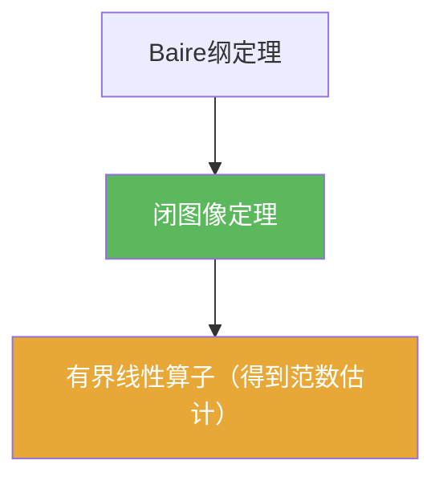

# 闭图像定理

> [!abstract] 概述
> 闭图像定理提供一种常用判别：如果你能证明 $x_n\to x$ 且 $Tx_n\to y$ 蕴含 $y=Tx$（即图像闭），那么 $T$ 自动是有界线性算子。这常用于“极限交换 ⇒ 有界估计”的推导。

## 定理表述

> [!def] 定理
> 设 $X,Y$ 为 Banach 空间，线性算子 $T:X\to Y$ 的图像
> $$\operatorname{Graph}(T)=\{(x,Tx):x\in X\}\subset X\times Y$$
> 若为闭集，则 $T$ 有界。

## 核心性质（命题工具箱）

| 性质/命题 | 表述（可直接引用） | 用途（做题时怎么用） |
|------|------|------|
| 图像闭 $\Rightarrow$ 有界 | 若 $\operatorname{Graph}(T)$ 在 $X\times Y$ 中闭，则 $T$ 有界 | 常用：只要能证明“极限交换合法”，就得到有界估计 |
| 常见证明形态 | $x_n\to x$ 且 $Tx_n\to y \Rightarrow y=Tx$ | 做题时直接把它当作“闭图像”定义来验证 |
| Baire 引擎 | 本质仍来自 Baire 纲定理 | 与开映射/有界逆并列的三件套 |

## 关系网络

## 章节扩展

### 第02章：线性算子与线性泛函

- 2.3：与开映射/有界逆并列的三件套之一：[[2.3 纲与开映射定理#二、核心思想]]

### 第04章：Baire纲定理的应用

- 4.4：图像闭的验证套路与典型应用：[[4.4 闭图像定理#二、核心思想]]

## 补充

> [!info] 常见误区与来源
>
> - 误区：忘记 Banach（完备性）假设。闭图像定理在一般非完备空间中不一定成立。  
> - 误区：把“图像闭”误解为“像集闭”。定理要求的是图像集合 $\{(x,Tx)\}$ 在乘积空间里闭。
>
> **参考（权威外链）**
> - MIT 18.102 Lecture 4: https://ocw.mit.edu/courses/18-102-introduction-to-functional-analysis-spring-2021/038fc32ab9c1bb63a4f29bd9d7c97961_MIT18_102s21_lec4.pdf  
> - Wikipedia: Closed graph theorem: https://en.wikipedia.org/wiki/Closed_graph_theorem

## 参见

- [[开映射定理]]
- [[有界逆定理]]
