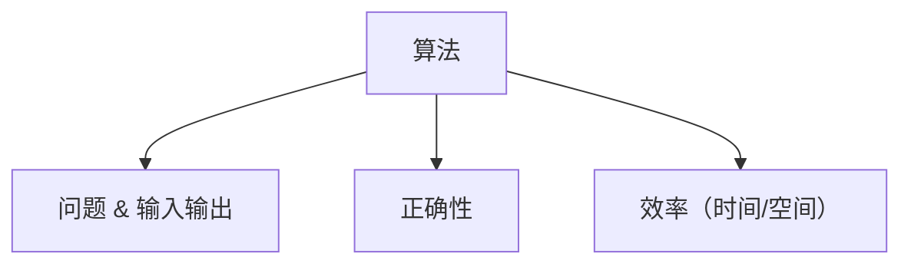

# 1.1 算法

> [!abstract] 概览
> - ==算法==：{用一句话写出你对“算法”的定义}
> - 本节目标：理解算法的定义、输入输出、正确性与效率的基本概念

## 素材
- [[Content/00-Raw素材/算法/CLRS4/算法导论_第四版/Part_I_Foundations/1_The_Role_of_Algorithms_in_Computing/1.1_Algorithms.pdf|分片PDF：1.1 Algorithms]]

---

## 知识结构图

---

## 核心内容（学习记录）
> [!def] 定义
> {写下你认为“算法”的形式化定义/要素}

> [!tip] 记忆要点
> - {要点1}
> - {要点2}

> [!warning] 易错点
> - ❌ {常见误解}
> - ✅ {正确理解}

---

## 参见 Wiki（候选）
- [[算法]]
- [[正确性证明]]
- [[渐进符号]]
