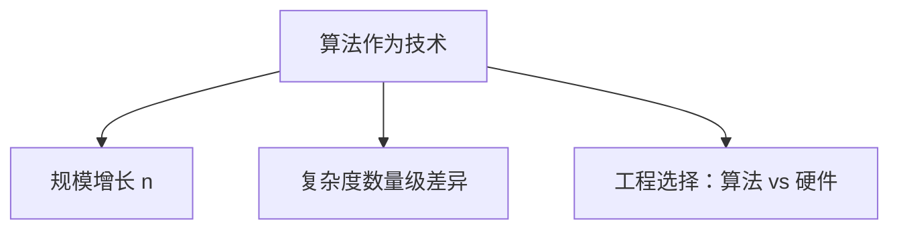

# 1.2 作为技术的算法

> [!abstract] 概览
> - ==算法工程==：{本节核心观点一句话}
> - 本节目标：理解算法改进对系统性能的数量级影响（规模 n 增长下的差异）

## 素材
- [[Content/00-Raw素材/算法/CLRS4/算法导论_第四版/Part_I_Foundations/1_The_Role_of_Algorithms_in_Computing/1.2_Algorithms_as_a_technology.pdf|分片PDF：1.2 Algorithms as a technology]]

---

## 知识结构图

---

## 核心内容（学习记录）
> [!tip] 关键论点
> {记录：为什么“更好的算法”比“更快的机器”更重要（在大规模下）}

> [!example] 例子（书中/你自己的）
> - {例子：O(n^2) vs O(n log n) 在 n=... 时差距}

> [!warning] 易错点
> - ❌ 只看常数不看数量级
> - ✅ 在增长规模下对比复杂度

---

## 参见 Wiki（候选）
- [[时间复杂度]]
- [[渐进符号]]
- [[O(n log n) vs O(n^2)]]
