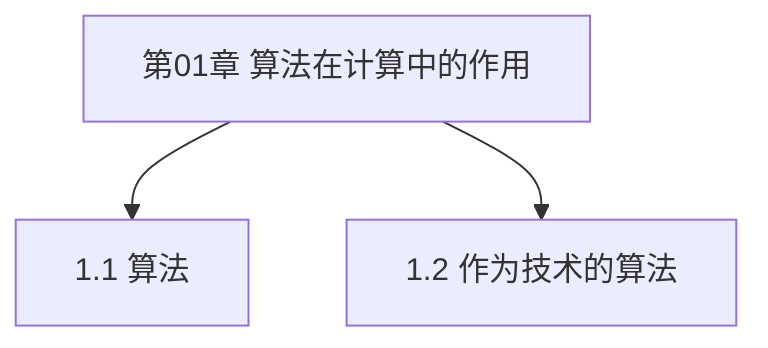

# 第01章 算法在计算中的作用 — 章节汇总

> [!abstract] 本章你应该掌握
> - ==算法的定义与基本性质==：输入/输出、正确性、效率
> - ==算法作为技术==：复杂度数量级对系统能力的决定性影响

---

## 本章知识框架

---

## 各节索引
- [[1.1 算法]]
- [[1.2 作为技术的算法]]

---

## 本章素材（分片）
- [[Content/00-Raw素材/算法/CLRS4/算法导论_第四版/Part_I_Foundations/1_The_Role_of_Algorithms_in_Computing/1.1_Algorithms.pdf|PDF：1.1 Algorithms]]
- [[Content/00-Raw素材/算法/CLRS4/算法导论_第四版/Part_I_Foundations/1_The_Role_of_Algorithms_in_Computing/1.2_Algorithms_as_a_technology.pdf|PDF：1.2 Algorithms as a technology]]
- [[Content/00-Raw素材/算法/CLRS4/算法导论_第四版/Part_I_Foundations/1_The_Role_of_Algorithms_in_Computing/Problems.pdf|PDF：Chapter 1 Problems]]

---

## 关键结论（你学习后补全）
1. {结论 1}
2. {结论 2}

---

## 本章 Wiki 贡献（Ingest 后更新）
- Concepts：
  - （待添加）
- Comparisons：
  - （待添加）
