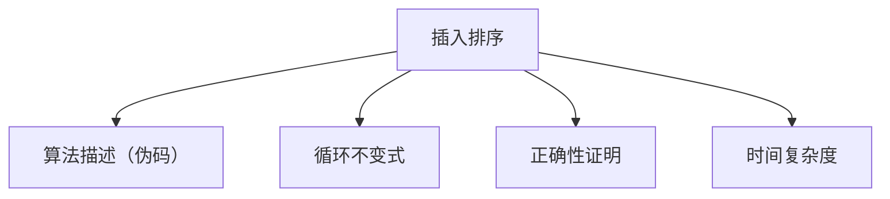

# 2.1 插入排序

> [!abstract] 概览
> - ==插入排序==：逐个将元素插入到“已排序前缀”中
> - 关键词：循环不变式、正确性证明、最坏/最好情况

## 素材
- [[Content/00-Raw素材/算法/CLRS4/算法导论_第四版/Part_I_Foundations/2_Getting_Started/2.1_Insertion_sort.pdf|分片PDF：2.1 Insertion sort]]

---

## 知识结构图


---

## 核心内容（学习记录）

> [!def] 循环不变式（你学习后补全）
> {写出：外层循环每次迭代开始时，“已排序前缀”满足的性质}

> [!tip] 正确性证明套路
> - 初始化：{为什么一开始成立}
> - 保持：{为什么迭代后仍成立}
> - 终止：{为什么推出最终正确}

```cpp
// 插入排序（示意）
void insertionSort(vector<int>& a) {
  for (int i = 1; i < (int)a.size(); ++i) {
    int key = a[i];
    int j = i - 1;
    while (j >= 0 && a[j] > key) {
      a[j + 1] = a[j];
      --j;
    }
    a[j + 1] = key;
  }
}
```

> [!warning] 易错点
> - ❌ 把“比较次数”和“交换/移动次数”混在一起
> - ✅ 明确本算法是“移动元素”，并据此数操作次数

---

## 参见 Wiki（候选）
- [[排序]]
- [[循环不变式]]
- [[时间复杂度]]

