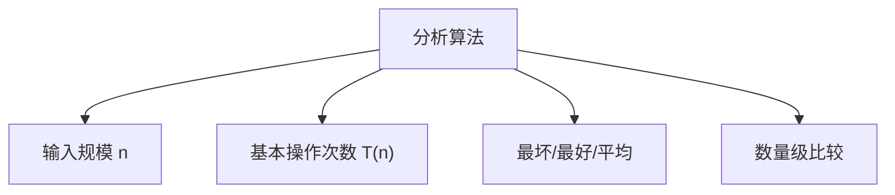

# 2.2 分析算法

> [!abstract] 概览
> - ==分析算法==：把“输入规模 n”与“基本操作次数/运行时间”联系起来
> - 关键词：最坏情况、平均情况、增长量级

## 素材
- [[Content/00-Raw素材/算法/CLRS4/算法导论_第四版/Part_I_Foundations/2_Getting_Started/2.2_Analyzing_algorithms.pdf|分片PDF：2.2 Analyzing algorithms]]

---

## 知识结构图

---

## 核心内容（学习记录）

> [!def] 输入规模与基本操作
> {写下：本节对“输入规模 n”和“基本操作”的选择原则}

> [!tip] 常用分析流程
> 1) 选输入规模 n  
> 2) 选基本操作（比较/赋值/访问等）  
> 3) 写出 T(n) 并化简  
> 4) 给出最坏/最好/平均（若需要）

> [!example] 插入排序的最坏情况（你补全）
> {把逆序数组时的比较/移动次数写成 T(n)}

---

## 参见 Wiki（候选）
- [[渐进符号]]
- [[最坏情况分析]]
- [[平均情况分析]]

