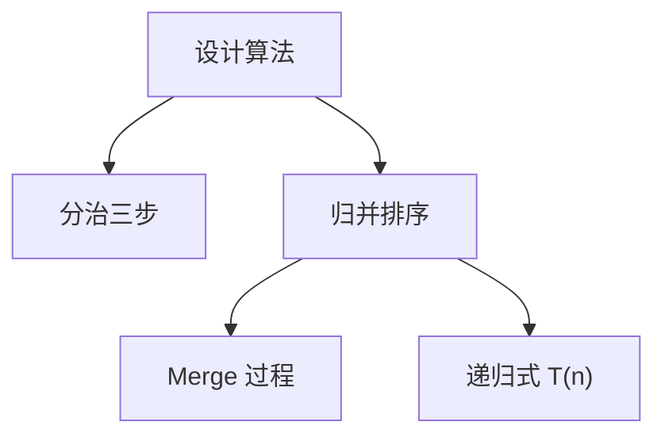

# 2.3 设计算法

> [!abstract] 概览
> - ==分治==：分解 → 解决 → 合并
> - 本节目标：用“分治”思路理解归并排序，并能写出递归式

## 素材
- [[Content/00-Raw素材/算法/CLRS4/算法导论_第四版/Part_I_Foundations/2_Getting_Started/2.3_Designing_algorithms.pdf|分片PDF：2.3 Designing algorithms]]

---

## 知识结构图


---

## 核心内容（学习记录）

> [!def] 分治三步（你学习后补全）
> - Divide：{怎么分}
> - Conquer：{怎么解}
> - Combine：{怎么合并}

> [!tip] 归并排序的关键点
> - Merge 的线性合并
> - 递归式：T(n) = 2T(n/2) + Θ(n)

```cpp
// 归并排序（示意框架）
void mergeSort(vector<int>& a, int l, int r) {
  if (r - l <= 1) return;
  int m = (l + r) / 2;
  mergeSort(a, l, m);
  mergeSort(a, m, r);
  // merge(a[l..m), a[m..r))
}
```

> [!warning] 易错点
> - ❌ 把“分治”理解成只要递归就是分治
> - ✅ 分治强调“可分解 + 子问题结构相同 + 合并代价可控”

---

## 参见 Wiki（候选）
- [[分治]]
- [[归并排序]]
- [[递归式]]

