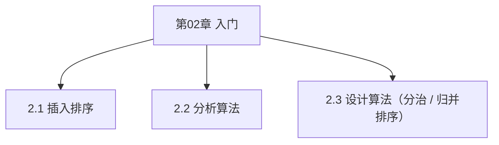

# 第02章 入门 — 章节汇总

> [!abstract] 本章你应该掌握
> - ==插入排序==：用循环不变式证明正确性，能分析最好/最坏时间复杂度
> - ==算法分析==：选定输入规模与基本操作，写出 T(n) 并比较增长量级
> - ==分治==：理解归并排序，写出递归式 T(n)=2T(n/2)+Θ(n)

---

## 本章知识框架

---

## 各节索引
- [[2.1 插入排序]]
- [[2.2 分析算法]]
- [[2.3 设计算法]]

---

## 本章素材（分片）
- [[Content/00-Raw素材/算法/CLRS4/算法导论_第四版/Part_I_Foundations/2_Getting_Started/2.1_Insertion_sort.pdf|PDF：2.1 Insertion sort]]
- [[Content/00-Raw素材/算法/CLRS4/算法导论_第四版/Part_I_Foundations/2_Getting_Started/2.2_Analyzing_algorithms.pdf|PDF：2.2 Analyzing algorithms]]
- [[Content/00-Raw素材/算法/CLRS4/算法导论_第四版/Part_I_Foundations/2_Getting_Started/2.3_Designing_algorithms.pdf|PDF：2.3 Designing algorithms]]
- [[Content/00-Raw素材/算法/CLRS4/算法导论_第四版/Part_I_Foundations/2_Getting_Started/Problems.pdf|PDF：Chapter 2 Problems]]

---

## 关键结论（你学习后补全）
1. {结论 1}
2. {结论 2}

---

## 本章 Wiki 贡献（Ingest 后更新）
- Concepts：
  - （待添加）
- Comparisons：
  - （待添加）

