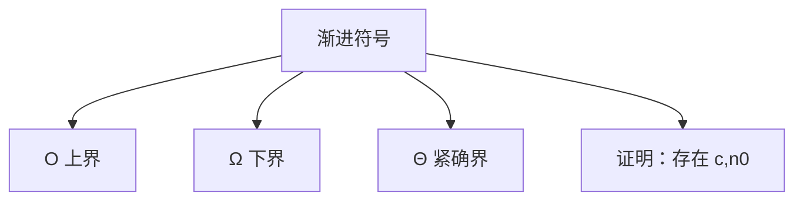

# 3.1 O-notation、Ω-notation 和 Θ-notation

> [!abstract] 概览
> - ==大O==：上界（增长不超过某个函数的常数倍）
> - ==大Ω==：下界（增长不少于某个函数的常数倍）
> - ==大Θ==：紧确界（同时给出上/下界）

## 素材
- [[Content/00-Raw素材/算法/CLRS4/算法导论_第四版/Part_I_Foundations/3_Characterizing_Running_Times/3.1_O-notation,_Ω-notation,_and_Θ-notation.pdf|分片PDF：3.1 O/Ω/Θ-notation]]

---

## 知识结构图

---

## 核心内容（学习记录）

> [!def] 定义（你学习后按书补全形式化表达）
> - $f(n)=O(g(n))$：{写出存在 c,n0 的定义}
> - $f(n)=Ω(g(n))$：{写出定义}
> - $f(n)=Θ(g(n))$：{写出定义}

> [!tip] 证明模板
> 1) 目标：找到常数 $c$ 与阈值 $n_0$  
> 2) 从不等式出发，化为“对所有 n≥n0 成立”  
> 3) 选取足够大的 n0（或直接给出上界）

> [!warning] 易错点
> - ❌ 把 $O$ 当成“约等于”
> - ✅ $O$ 是集合/关系（上界），不是数值近似

---

## 参见 Wiki（候选）
- [[渐进符号]]
- [[大O]]
- [[大Ω]]
- [[大Θ]]

