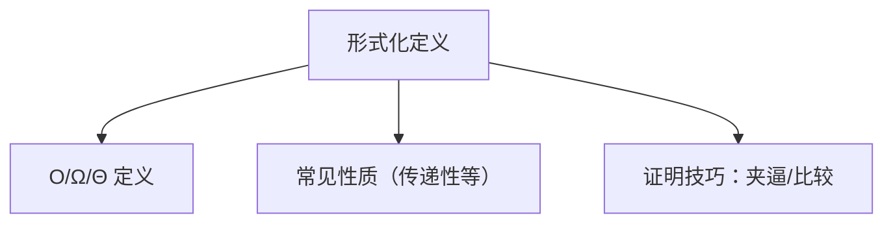

# 3.2 渐进符号：形式化定义

> [!abstract] 概览
> - 本节把 3.1 的直觉升级为**严格定义**与常用推论
> - 目标：能熟练用定义证明函数间的 O/Ω/Θ 关系

## 素材
- [[Content/00-Raw素材/算法/CLRS4/算法导论_第四版/Part_I_Foundations/3_Characterizing_Running_Times/3.2_Asymptotic_notation__formal_definitions.pdf|分片PDF：3.2 Asymptotic notation formal definitions]]

---

## 知识结构图

---

## 核心内容（学习记录）

> [!def] 常用性质（你学习后补全）
> - 传递性：{写出 O 的传递性}
> - 对称性：{Θ 的对称性}
> - 可加性/可乘性：{常见规则}

> [!example] 典型证明练习
> - 证明：$n^2 + 3n + 2 = Θ(n^2)$（按定义写出 c,n0）

> [!warning] 易错点
> - ❌ 只做极限不写“存在 c,n0”
> - ✅ 用极限推导后，仍要落回到定义的“存在性”表述

---

## 参见 Wiki（候选）
- [[渐进符号]]
- [[证明技巧：夹逼]]

