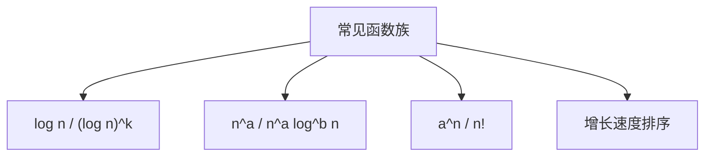

# 3.3 标准符号与常见函数

> [!abstract] 概览
> - 目标：熟悉算法分析里反复出现的函数族（对数、多项式、指数、阶乘等）
> - 关键：能快速判断增长速度（谁更快/谁支配谁）

## 素材
- [[Content/00-Raw素材/算法/CLRS4/算法导论_第四版/Part_I_Foundations/3_Characterizing_Running_Times/3.3_Standard_notations_and_common_functions.pdf|分片PDF：3.3 Standard notations and common functions]]

---

## 知识结构图

---

## 核心内容（学习记录）

> [!tip] 常用增长速度直觉（先写结论，后补证明）
> - 对数 < 多项式 < 指数 < 阶乘
> - 任意常数底的 log 只差常数倍

> [!example] 你自己整理一个“常见排序”
> $1 < \\log n < n^{0.5} < n < n\\log n < n^2 < 2^n < n!$

> [!warning] 易错点
> - ❌ 忽略对数底变化带来的“常数倍”
> - ✅ 记住：换底公式只差常数因子，对 O/Θ 不敏感

---

## 参见 Wiki（候选）
- [[对数函数]]
- [[多项式]]
- [[指数函数]]
- [[阶乘]]

