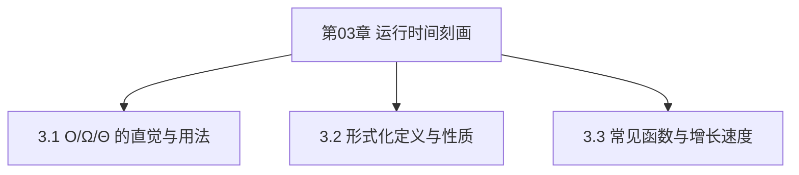

# 第03章 运行时间刻画 — 章节汇总

> [!abstract] 本章你应该掌握
> - ==O/Ω/Θ==：能按“存在 c,n0”的定义写出严格证明
> - ==常见函数增长==：能快速比较 log、多项式、指数、阶乘的增长速度
> - ==分析语言统一==：把算法的 T(n) 用标准符号表达、并能做数量级比较

---

## 本章知识框架

---

## 各节索引
- [[3.1 O-notation_Ω-notation_和_Θ-notation]]
- [[3.2 渐进符号：形式化定义]]
- [[3.3 标准符号与常见函数]]

---

## 本章素材（分片）
- [[Content/00-Raw素材/算法/CLRS4/算法导论_第四版/Part_I_Foundations/3_Characterizing_Running_Times/3.1_O-notation,_Ω-notation,_and_Θ-notation.pdf|PDF：3.1 O/Ω/Θ]]
- [[Content/00-Raw素材/算法/CLRS4/算法导论_第四版/Part_I_Foundations/3_Characterizing_Running_Times/3.2_Asymptotic_notation__formal_definitions.pdf|PDF：3.2 Formal definitions]]
- [[Content/00-Raw素材/算法/CLRS4/算法导论_第四版/Part_I_Foundations/3_Characterizing_Running_Times/3.3_Standard_notations_and_common_functions.pdf|PDF：3.3 Common functions]]
- [[Content/00-Raw素材/算法/CLRS4/算法导论_第四版/Part_I_Foundations/3_Characterizing_Running_Times/Problems.pdf|PDF：Chapter 3 Problems]]

---

## 关键结论（你学习后补全）
1. {结论 1}
2. {结论 2}

