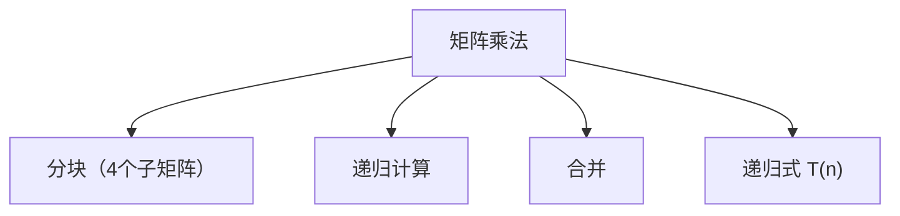

# 4.1 方阵相乘

> [!abstract] 概览
> - ==分治矩阵乘法==：把矩阵切成 4 个子块，递归计算并合并
> - 目标：为 4.2 Strassen 算法做铺垫（降低乘法次数）

## 素材
- [[Content/00-Raw素材/算法/CLRS4/算法导论_第四版/Part_I_Foundations/4_Divide-and-Conquer/4.1_Multiplying_square_matrices.pdf|分片PDF：4.1 Multiplying square matrices]]

---

## 知识结构图

---

## 核心内容（学习记录）
> [!def] 分块表示（你补全）
> $A=\\begin{pmatrix}A_{11}&A_{12}\\\\A_{21}&A_{22}\\end{pmatrix}$，$B=\\begin{pmatrix}B_{11}&B_{12}\\\\B_{21}&B_{22}\\end{pmatrix}$

> [!tip] 递归式（你补全）
> {写出：分块后需要多少次子矩阵乘法与加法，从而得到 T(n)}

> [!warning] 易错点
> - ❌ 忽略“合并/加法”带来的 Θ(n^2) 代价
> - ✅ 子问题数量 + 合并代价共同决定递归式

---

## 参见 Wiki（候选）
- [[分治]]
- [[递归式]]
- [[矩阵乘法]]

