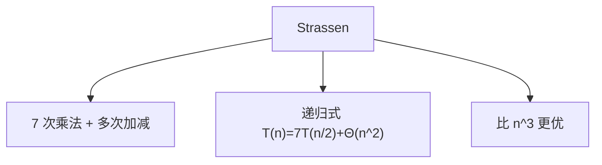

# 4.2 Strassen 矩阵乘法算法

> [!abstract] 概览
> - ==核心思想==：用 7 次子矩阵乘法替代常规的 8 次（牺牲更多加法）
> - 目标：得到更优递归式并用第 4 章后半部分方法求解

## 素材
- [[Content/00-Raw素材/算法/CLRS4/算法导论_第四版/Part_I_Foundations/4_Divide-and-Conquer/4.2_Strassen’s_algorithm_for_matrix_multiplication.pdf|分片PDF：4.2 Strassen’s algorithm]]

---

## 知识结构图

---

## 核心内容（学习记录）
> [!def] 7 个中间量（你按书补全）
> {记录：P1..P7 的定义，以及 C11/C12/C21/C22 如何由它们组合}

> [!tip] 复杂度结论
> - 递归式：$T(n)=7T(n/2)+Θ(n^2)$  
> - 结果：$T(n)=Θ(n^{\\log_2 7})$

> [!warning] 易错点
> - ❌ 只记结论，不理解“减少一次乘法”的来源
> - ✅ 把“8→7”的代数恒等式写清楚，并能复现组合公式

---

## 参见 Wiki（候选）
- [[分治]]
- [[递归式]]
- [[主方法]]

