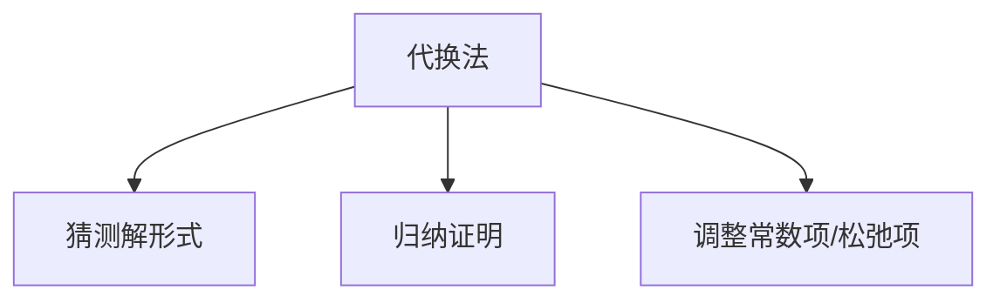

# 4.3 代换法求解递归式

> [!abstract] 概览
> - ==代换法==：先猜测解的形式，再用数学归纳法证明
> - 关键：归纳假设里常需要加入“松弛项”（例如减去一个常数）以保证闭合

## 素材
- [[Content/00-Raw素材/算法/CLRS4/算法导论_第四版/Part_I_Foundations/4_Divide-and-Conquer/4.3_The_substitution_method_for_solving_recurrences.pdf|分片PDF：4.3 Substitution method]]

---

## 知识结构图

---

## 核心内容（学习记录）
> [!tip] 标准流程
> 1) 猜：$T(n)=O(f(n))$ 或 $T(n)=Ω(f(n))$  
> 2) 归纳假设：对更小规模成立  
> 3) 代回递归式并推出对 n 成立  
> 4) 选择合适常数使不等式闭合

> [!example] 练习（你按书补全）
> - 用代换法证明：$T(n)=2T(n/2)+n$ 的解是 $T(n)=Θ(n\\log n)$

> [!warning] 易错点
> - ❌ 只做“代入展开”但没有归纳闭合
> - ✅ 明确你是在证明上界还是下界，并写清常数选择条件

---

## 参见 Wiki（候选）
- [[递归式]]
- [[数学归纳法]]

