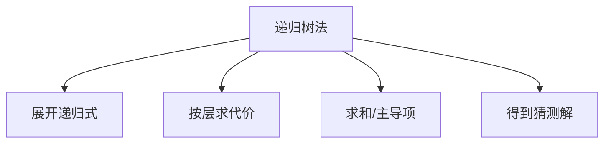

# 4.4 递归树法求解递归式

> [!abstract] 概览
> - ==递归树==：把递归式展开成一棵树，计算每层代价并求和
> - 适合：快速得到“猜测解”，再用代换法严格证明

## 素材
- [[Content/00-Raw素材/算法/CLRS4/算法导论_第四版/Part_I_Foundations/4_Divide-and-Conquer/4.4_The_recursion-tree_method_for_solving_recurrences.pdf|分片PDF：4.4 Recursion-tree method]]

---

## 知识结构图

---

## 核心内容（学习记录）
> [!tip] 使用步骤
> 1) 画出递归树（子问题规模、数量）  
> 2) 写出每层总代价  
> 3) 求层数（树高）  
> 4) 求和并找主导项

> [!example] 练习（你按书补全）
> - 用递归树分析：$T(n)=3T(n/4)+n^2$（看哪一层主导）

> [!warning] 易错点
> - ❌ 只看单个节点代价，忘记乘以该层节点数
> - ✅ 每层总代价 = 节点数 × 单节点代价

---

## 参见 Wiki（候选）
- [[递归式]]
- [[递归树]]

